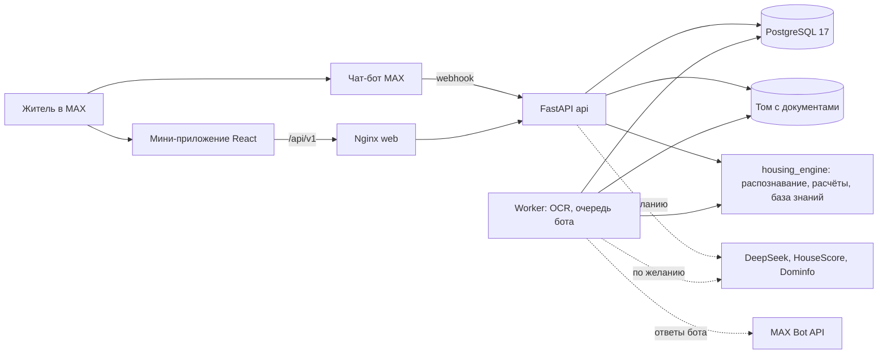

# Помощник ЖКХ в MAX

Чат-бот и мини-приложение в мессенджере MAX для людей, которые впервые сами разбираются с квитанцией ЖКХ. Помощник:
- находит управляющую компанию и поставщиков по адресу дома;
- подсказывает, куда передать показания и куда обращаться при аварии;
- распознаёт квитанцию и объясняет её строки;
- показывает, почему сумма изменилась по сравнению с прошлым месяцем;
- готовит текст обращения, который пользователь отправляет сам.

## Где проверить

| Что | Адрес |
|---|---|
| Чат-бот в MAX | [max.ru/t614_hakaton_max_bot](https://max.ru/t614_hakaton_max_bot) — команда `/start`, мини-приложение открывается кнопкой «Разобрать платёжку» |
| Мини-приложение (production, только внутри MAX) | https://flynntaggart075.asuscomm.com/team/zhkh/ |
| Учебный стенд в браузере (гостевой вход, синтетические данные) | https://flynntaggart075.asuscomm.com/team/zhkh-preview/ |
| Собственный API | `https://flynntaggart075.asuscomm.com/team/zhkh/api/v1` (production), `https://flynntaggart075.asuscomm.com/team/zhkh-preview/api/v1` (учебный) |
| OpenAPI 3.1 | [contracts/http/openapi.yaml](contracts/http/openapi.yaml) |
| Проверки API для платформы оценки | [DATA-API.yaml](DATA-API.yaml) |
| Репозиторий | https://github.com/FlynnTaggart076/VK_Hackathon — зафиксированная версия отмечена тегом `submission`, её commit hash указан на первом слайде презентации |

Проверка в Docker не заменяет работающую версию: бот и мини-приложение в MAX доступны по ссылкам выше на всё время проверки.

## Основной пользовательский сценарий

«Получил непонятную платёжку → проверил цифры → понял, что изменилось → знаю, что делать дальше».

1. Житель открывает бота, нажимает `/start` и кнопку «Разобрать платёжку». Открывается мини-приложение.
2. На экране «Первый запуск» выбирает роль и регион и подтверждает уведомление об обработке данных.
3. На вкладке «Платёжка» загружает PDF или фото квитанции. Сервер распознаёт строки: услуги, объём, тариф, суммы, перерасчёты и итоги.
4. Житель сверяет распознанные цифры с оригиналом, исправляет ошибки и подтверждает данные. Приложение объясняет каждую строку и итоги.
5. Житель загружает квитанцию за следующий месяц и спрашивает помощника «почему выросла сумма». Помощник показывает:
   - разницу начислений и суммы к оплате;
   - изменения по услугам с разложением на влияние объёма и влияние тарифа;
   - отдельно перерасчёты, долг и оплаты.
6. Следующий шаг:
   - контакты УК и поставщика по адресу дома;
   - куда передать показания;
   - редактируемый черновик запроса расшифровки начисления, который житель копирует и отправляет сам.

Вопрос можно задать в чате бота или во вкладке «Помощник» своими словами. Нейросеть DeepSeek понимает вопрос и предлагает кнопки с нужными функциями; цифры, контакты и справочные ответы формирует код, а не модель.

## Состав и архитектура



| Компонент | Путь | Что делает |
|---|---|---|
| `web` | `apps/web`, `infra/web.Dockerfile` | Мини-приложение: React 19 и TypeScript, собирается Vite и раздаётся Nginx. Этот же Nginx проксирует `/api/`, `/integrations/`, `/health/` на API |
| `api` | `apps/backend` | FastAPI: вход через MAX, профиль, загрузка и проверка квитанций, сравнение, помощник, черновики, webhook бота |
| `worker` | тот же образ, команда `python -m app.jobs.worker` | Очередь в PostgreSQL: распознавание квитанций в отдельном процессе, ответы бота через outbox, очистка по срокам хранения |
| `migrate` | тот же образ, `alembic upgrade head` | Разовая миграция схемы перед запуском API и worker |
| `db` | `postgres:17` | Данные: пользователи, квитанции и их ревизии, задания, состояние диалогов, очередь бота |
| `housing_engine` | `packages/housing_engine` | Python-библиотека без сети и БД: разбор PDF и фото (pypdf, Tesseract), валидация, арифметика в `Decimal`, сравнение квитанций, справочник тем |
| База знаний | `knowledge/` | 15 справочных тем с проверенными источниками, каталог функций и описание приложения для DeepSeek (`knowledge/assistant/`) |

Устройство помощника: нажатия кнопок и понятные ответы (город, услуга, адрес) обрабатываются кодом. Остальной свободный текст уходит в DeepSeek, который выбирает функцию из каталога `knowledge/assistant/capabilities.yaml` или задаёт уточнение с кнопками. Сервер проверяет каждое решение модели; если модель недоступна, работают правила. Подробнее — [docs/change-request-deepseek-router.md](docs/change-request-deepseek-router.md).

## Запуск в Docker одной командой

Нужны Docker 24+ и Docker Compose v2. Из корня репозитория:

```sh
cp .env.example .env
docker compose -f compose.yaml -f compose.local.yaml up --build -d
```

Затем откройте http://localhost:8080/team/zhkh/, выберите учётную запись «Проверяющий A» и введите код из `DEMO_ACCESS_CODE` в `.env` (по умолчанию `replace-with-private-random-code`). Готовность сервиса: http://localhost:8080/team/zhkh/health/ready должен ответить `200`.

- Сборка без кэша на обычном ноутбуке — около 2,5 минуты, не считая загрузки базовых образов.
- Если путь к папке содержит кириллицу и Compose завершается ошибкой `header key "x-docker-expose-session-sharedkey"`, запустите команду с переменной `COMPOSE_BAKE=false`.
- `compose.yaml` — базовая конфигурация без открытых портов. `compose.local.yaml` открывает web на `127.0.0.1:8080` и даёт API и worker выход в интернет для внешних сервисов. `compose.vm.yaml` и `compose.preview.vm.yaml` — production и учебный стенд на сервере, там web подключается к общему Nginx.

### Остановка и повторный запуск

```sh
docker compose -f compose.yaml -f compose.local.yaml stop       # остановить, данные сохраняются
docker compose -f compose.yaml -f compose.local.yaml up -d      # запустить снова
docker compose -f compose.yaml -f compose.local.yaml down       # удалить контейнеры, тома с БД и документами остаются
docker compose -f compose.yaml -f compose.local.yaml down -v    # полностью удалить локальные данные
```

После обновления кода повторите `up --build -d`: сервис `migrate` сам применит новые миграции.

## Параметры окружения

Все значения задаются в `.env`, образец — [.env.example](.env.example). Рабочих токенов и паролей в репозитории нет.

| Переменная | Обязательна | Значение по умолчанию | Назначение |
|---|---|---|---|
| `POSTGRES_PASSWORD` | да | — | Пароль PostgreSQL. Без него Compose не запустится |
| `APP_MODE` | нет | `dev` | `dev`, `demo`, `preview` или `production`. Production запрещает демо-вход |
| `ENGINE_MODE` | нет | `real` | `real` — настоящее распознавание, `stub` — заглушка только для разработки |
| `DEMO_AUTH_ENABLED` | нет | `true` | Вход по коду без MAX (только `dev` и `demo`) |
| `DEMO_ACCESS_CODE` | при демо-входе | — | Код демо-входа |
| `LOCAL_WEB_PORT` | нет | `8080` | Локальный порт web |
| `MAX_BOT_TOKEN` | для бота | пусто | Токен бота MAX. Без него чат не работает, мини-приложение и API работают |
| `MAX_WEBHOOK_SECRET` | для бота | пусто | Секрет входящих событий MAX (`X-Max-Bot-Api-Secret`) |
| `MAX_WEB_APP` | для кнопки | пусто | Имя бота для кнопки открытия мини-приложения |
| `MAX_API_BASE_URL` | нет | `https://platform-api2.max.ru` | Адрес API MAX |
| `DEEPSEEK_API_KEY` | нет | пусто | Ключ DeepSeek. Без него помощник отвечает по правилам и кнопкам |
| `DEEPSEEK_MODEL` | нет | `deepseek-flash` | Модель DeepSeek (`deepseek-flash` или `deepseek-v4-pro`) |
| `HOUSESCORE_API_KEY` | нет | пусто | Ключ HouseScore для поиска дома и УК. Без него работает только кэш |
| `HOUSESCORE_DAILY_LIMIT` | нет | `30` | Лимит живых запросов к HouseScore в сутки на весь сервис |
| `HOUSE_LOOKUP_USER_DAILY_LIMIT` | нет | `5` | Лимит новых адресов в сутки на пользователя |

Compose задаёт внутренние переменные сам: `DATABASE_URL`, `STORAGE_PATH=/storage`, `APP_ROOT_PATH=/team/zhkh`, `FIXTURE_ROOT`, `KNOWLEDGE_ROOT`. Параметры сборки web: `VITE_APP_BASE` (`/team/zhkh/`) и `VITE_PREVIEW_MODE` (`false`).

## Порты

| Порт | Где | Что |
|---|---|---|
| `127.0.0.1:8080` → `web:80` | хост (локальный запуск) | Мини-приложение, `/team/zhkh/api/v1`, `/team/zhkh/health/*`, `/team/zhkh/integrations/max/webhook` |
| `api:8000` | внутренняя сеть | FastAPI, наружу не публикуется |
| `db:5432` | внутренняя сеть | PostgreSQL, наружу не публикуется |

На сервере наружу публикуется только web через общий Nginx по префиксу `/team/zhkh/`, HTTPS завершается на внешнем входе.

## Зависимости

Все версии закреплены:
- `apps/backend/requirements.lock` — Python;
- `apps/web/package-lock.json` — npm;
- `packages/housing_engine/pyproject.toml` и `requirements.lock` — библиотека `housing_engine`;
- `scripts/requirements-contracts.lock` — проверка контрактов.

| Слой | Основное |
|---|---|
| Backend | Python 3.12, FastAPI 0.116, Pydantic 2, SQLAlchemy 2.0, Alembic 1.16, psycopg 3.2, httpx 0.28, PyYAML |
| Распознавание | Tesseract 5.3 (rus и eng) из пакетов Debian, pypdf, pypdfium2, Pillow |
| Frontend | Node 22 (только сборка), React 19.3, React Router 7.18, Vite 8.3, TypeScript 5.9 |
| Инфраструктура | PostgreSQL 17, Nginx 1.27.5 |


## Внешние сервисы и интеграции

| Сервис | Зачем | Условия | Без него |
|---|---|---|---|
| MAX Bot API и мини-приложения | Чат-бот, вход в мини-приложение по подписанным `initData` | Токен бота, публичный HTTPS-адрес на порту 443 для webhook, привязка адреса мини-приложения к боту на стороне MAX. Внутри Docker не воспроизводится | Мини-приложение и API работают с демо-входом; бот не отвечает |
| DeepSeek (`api.deepseek.com`) | Понимает вопросы своими словами и предлагает кнопки | `DEEPSEEK_API_KEY`, исходящий HTTPS. Модели передаётся только текст вопроса без адреса, телефонов и номеров | Помощник отвечает по правилам и кнопкам |
| HouseScore (`housescore.ru`) | По адресу дома находит дом, управляющую компанию и её контакты | `HOUSESCORE_API_KEY`, квота ключа около 100 запросов, новый дом стоит примерно 4 запроса. Ответы кэшируются на 7 дней | Контакты по адресу недоступны, кроме закэшированных домов; помощник даёт ссылку на поиск в ГИС ЖКХ |
| Dominfo (`dominfo.ru`) | Исторические сведения о поставщиках услуг дома | Без ключа, открытые JSON-методы сайта. С текущего сервера недоступен по сети | Поставщик помечается «не найден», контакты УК остаются |

Ни один внешний сервис не нужен для запуска и проверки основного сценария квитанций. Распознавание, проверка, объяснение и сравнение работают полностью локально.

## Работа с данными

- **Кто видит данные.** У каждой квитанции есть владелец, доступ проверяется сервером в каждом запросе. Чужой идентификатор возвращает `404`.
- **Сроки хранения.**

  | Что | Срок |
  |---|---|
  | Исходные файлы | 7 дней |
  | Подтверждённые данные квитанций | 120 дней |
  | Ответы помощника, черновики, состояние диалога | 30 дней |
  | Сессии | 60 минут |

  Документ можно удалить на вкладке «История». Очистку по срокам выполняет worker.
- **Что уходит во внешние сервисы:**
  - в DeepSeek — текст вопроса после удаления адреса, телефонов, почты и длинных номеров, плюс последние 3 реплики диалога в таком же очищенном виде;
  - в HouseScore и Dominfo — адрес дома без квартиры и лицевого счёта.

  Файлы квитанций, ФИО и лицевой счёт не передаются никуда.
- **Нейросеть включена по умолчанию.** Отключить: кнопка «Без нейросети» или `/llm_off`, включить снова: `/llm_on`. Уведомление об обработке данных (версия 3.0) показывается перед первой загрузкой квитанции.
- **Городская статистика** считается только по подтверждённым квитанциям жителей, давших отдельное согласие. Значения показываются, если в городе и месяце не меньше пяти участников.
- **Хранилища.** Секреты хранятся вне репозитория: на сервере в `runtime/app.env` с правами `0600`. Документы лежат в закрытом томе и публичных ссылок не имеют.

## Тестовые данные и учётные записи

| Где | Как войти | Данные |
|---|---|---|
| Локальный Docker | «Проверяющий A» или «Проверяющий B» и код `DEMO_ACCESS_CODE` | Кнопки «Учебные образцы» на вкладке «Платёжка»: «Вода, август» (5 м³ × 40 ₽ = 200 ₽) и «Вода, сентябрь» (6 м³ × 45 ₽ = 270 ₽) |
| Учебный стенд `…/team/zhkh-preview/` | Гость создаётся автоматически | Те же учебные образцы, плюс квитанции Москвы и Люберец для сравнения с искусственной городской выборкой |
| Production в MAX | Вход через MAX | Реальные квитанции пользователя. Распознаётся единый платёжный документ Московской области (МосОблЕИРЦ) |

Все учебные данные синтетические и помечены в интерфейсе как учебные. Файлы лежат в [fixtures/](fixtures):
- `receipts` — квитанции в PDF, PNG и JSON с ожидаемыми значениями;
- `questions` — 5 наборов по 75 вопросов для справочника;
- `assistant/router_cases.json` — 40 фраз для проверки DeepSeek.

Два пользователя (A и B) нужны, чтобы проверить изоляцию: квитанции A не видны B.

## Пошаговый сценарий проверки

### В MAX

1. Откройте [бота](https://max.ru/t614_hakaton_max_bot) и отправьте `/start`. Появится приветствие и кнопки «Контакты поставщика», «Контакты УК», «Передать показания», «Почему выросла сумма», «Разобрать платёжку».
2. Напишите «у меня что-то с водой». Бот уточнит, что именно, и предложит кнопки: авария, рост суммы, показания, поставщик.
3. Нажмите «Контакты поставщика» → «Холодная вода» и отправьте адрес, например «Люберцы, проспект Гагарина, дом 24, корпус 2». Придёт карточка: поставщик, управляющая компания с телефоном и почтой, источник данных. Кнопки «Другая услуга» и «Другой адрес» работают без повторного ввода.
4. Напишите «а горячей?» — бот поймёт, что речь о том же доме.
5. Нажмите «Разобрать платёжку», чтобы открыть мини-приложение. Пройдите «Первый запуск», затем загрузите квитанцию на вкладке «Платёжка».
6. Проверьте распознанные строки: нажатие на строку раскрывает её. Подтвердите данные и откройте объяснение.
7. Загрузите квитанцию за следующий месяц и спросите помощника «почему выросла сумма».

### В браузере на учебном стенде или локально

1. Откройте https://flynntaggart075.asuscomm.com/team/zhkh-preview/ или локальный http://localhost:8080/team/zhkh/ (демо-вход, см. выше).
2. «Изменить роль и территорию» внизу экрана: роль, регион, согласие → «Сохранить».
3. «Платёжка» → «Учебные образцы» → «Вода, август». Откроется проверка: сверьте цифры и нажмите «Подтвердить проверенные данные» (учебное предупреждение отмечается галочкой).
4. Повторите шаг 3 для «Вода, сентябрь».
5. «Помощник» → «Почему выросла сумма».
6. «История» → «Сравнить квитанции» → август и сентябрь.
7. «Помощник»: «кто поставляет свет в дом», затем адрес «Люберцы, проспект Гагарина, дом 24, корпус 2».
   - На учебном стенде нет ключа HouseScore, поэтому работают только дома из кэша, в том числе этот адрес.
   - Локально поиск по адресу работает, если задать `HOUSESCORE_API_KEY` в `.env`.
   - В MAX (production) ключ задан, и искать можно любой дом.

### API

Порядок вызовов, ожидаемые коды и поля описаны в [DATA-API.yaml](DATA-API.yaml): гостевой вход, профиль, помощник, импорт и подтверждение учебной квитанции, объяснение, сравнение, проверка доступа. Все методы описаны в [OpenAPI](contracts/http/openapi.yaml).

## Примеры ожидаемого поведения

| Действие | Ожидаемый результат |
|---|---|
| Сравнить учебные квитанции август (5 м³ × 40 ₽) и сентябрь (6 м³ × 45 ₽) | Разница начислений +70,00 ₽, из них объём +40,00 ₽ и тариф +30,00 ₽ |
| «Почему выросла сумма» без квитанций | Объяснение, что нужны две подтверждённые квитанции за соседние месяцы, и кнопка «Загрузить квитанцию» |
| «у меня что-то с водой» | Уточняющий вопрос с 2–5 кнопками и вариантом «Другое — напишу сам» |
| «кто поставляет свет в дом», потом адрес | Карточка: поставщик (с пометкой, что сведения исторические), УК с телефоном и почтой, ссылки на сайт и источник |
| «можно отправить жалобу через вас?» | Короткий ответ, что приложение не отправляет обращения, и кнопка «Подготовить обращение» |
| «напиши стих про кота» | Вежливый возврат к теме ЖКХ и меню |
| Исправить распознанное число и подтвердить | Новая ревизия квитанции; объяснение строится по исправленным цифрам |
| Открыть квитанцию из другой вкладки после изменения | `409` и предложение загрузить актуальную версию |
| Голосовое сообщение или файл в чат бота | Текстовый ответ: голос не обрабатывается, квитанцию нужно загрузить в мини-приложении |
| Запрос API без токена или к чужой квитанции | `401` / `404` в формате `{error, request_id}` |

## Проверки кода

```sh
# Backend и библиотека: Python 3.12, зависимости из apps/backend/requirements.lock
pip install -r apps/backend/requirements.lock
PYTHONPATH="apps/backend:packages/housing_engine/src" python -m pytest apps/backend/tests packages/housing_engine/tests -q
python scripts/check_http_contract.py            # OpenAPI и примеры (scripts/requirements-contracts.lock)

# Frontend
cd apps/web && npm ci && npm test && npm run build

# Живая проверка маршрутизатора DeepSeek (тратит токены, нужен DEEPSEEK_API_KEY)
PYTHONPATH="apps/backend:packages/housing_engine/src" python scripts/eval_assistant_router.py
```

В Windows `PYTHONPATH` разделяется `;`. Тесты не обращаются к внешним сервисам, кроме последней команды.

## Известные ограничения

- **Распознавание.** Надёжно распознаются учебный макет и единый платёжный документ Московской области (МосОблЕИРЦ). Другие форматы открываются в режиме ручной проверки. Распознанные цифры всегда подтверждает пользователь.
- **Поставщики услуг** берутся из исторических открытых данных Dominfo: действующий договор нужно сверить с квитанцией. С текущего сервера Dominfo недоступен по сети, поэтому для новых адресов в production показываются только управляющая компания и её контакты.
- **Квота HouseScore** — около 100 запросов на ключ, поэтому действуют суточные лимиты; уже найденные дома берутся из кэша.
- **Проверенные местные инструкции** есть только для Москвы и Московской области; для других регионов помощник даёт общий порядок и контакты УК.
- **Сравнение с городом** появится, когда наберётся не меньше пяти жителей с согласием. На учебном стенде сравнение идёт с искусственной выборкой и помечено как учебное.
- **Приложение не делает** следующего: не отправляет обращения, не принимает оплату, не передаёт показания за пользователя, не даёт юридических заключений и не работает с голосом.
- **Вход в production** возможен только через MAX. Демо-вход есть только в режимах `dev` и `demo`, а в браузере для проверки доступен учебный стенд.
- **Нейросеть** иногда отвечает дольше обычного (1–3 секунды). Если она недоступна, помощник продолжает работать по правилам.

## Документация

- [docs/deployment.md](docs/deployment.md) — развёртывание на сервере, backup и восстановление.
- [docs/backend.md](docs/backend.md), [docs/frontend.md](docs/frontend.md), [docs/engine.md](docs/engine.md) — устройство компонентов.
- [docs/data-provenance.md](docs/data-provenance.md) — происхождение тестовых данных.
- [docs/change-request-dialog-house-lookup.md](docs/change-request-dialog-house-lookup.md) и [docs/change-request-deepseek-router.md](docs/change-request-deepseek-router.md) — помощник, поиск по адресу, DeepSeek.
- [TECHNICAL_SPEC.md](TECHNICAL_SPEC.md) — исходное техническое задание.
