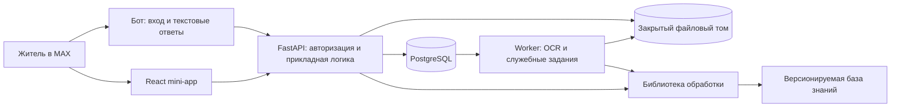

# Техническое задание: помощник по первым вопросам ЖКХ

**Версия:** 1.1 · **Дата:** 27.09.2026 · **Горизонт реализации:** четыре недели.

**Утверждённая тема:** «Общий помощник по первым вопросам ЖКХ с функцией объяснения платёжек и подсказки следующего шага».

Документ предназначен для трёх агентов-кодеров, разрабатывающих компоненты параллельно. Он задаёт общий продукт, интерфейсы компонентов, границы редактирования, приёмочные сценарии и порядок интеграции. Это задание на будущую реализацию; перечисленные возможности ещё не разработаны и не проверены на пользователях.

**Распознавание речи, голосовой ввод, транскрибация и обработка аудио полностью исключены.** OCR ниже означает исключительно распознавание печатного текста в изображениях и PDF-квитанциях.

Актуальные поручения владельца имеют приоритет над `Prompt.txt`: работают три агента-кодера под управлением координатора, исходники и результаты сохраняются в [GitHub-репозитории проекта](https://github.com/FlynnTaggart076/VK_Hackathon.git), приложение разворачивается внутри уже подготовленной виртуальной машины. Координатор — роль управления и приёмки, которую выполняет ведущий агент или человек; четвёртый разработчик не требуется. Три кодера не означают три микросервиса.

Рабочая инструкция по VM — [«Работа с сервером.md»](<Работа с сервером.md>). Разрешены разработка, Docker-развёртывание приложения и подключение его маршрута к существующему Nginx внутри VM в границах этой инструкции. CI/CD, настройка гипервизора, внешнего входа, маршрутизатора и новой инфраструктуры HTTPS в объём не входят. Настоящий файл задаёт будущую работу: его обновление само по себе не означает запуск агентов, push кода или выполненное развёртывание.

## Содержание

1. [Цель, аудитория и результат](#1-цель-аудитория-и-результат)
2. [Объём MVP и ограничения](#2-объём-mvp-и-ограничения)
3. [Пользовательские сценарии](#3-пользовательские-сценарии)
4. [Функциональные требования](#4-функциональные-требования)
5. [Архитектура и стек](#5-архитектура-и-стек)
6. [Модель данных и состояния](#6-модель-данных-и-состояния)
7. [Публичный HTTP API](#7-публичный-http-api)
8. [Контракт библиотеки обработки](#8-контракт-библиотеки-обработки)
9. [Извлечение, расчёты и сравнение](#9-извлечение-расчёты-и-сравнение)
10. [База знаний и следующие действия](#10-база-знаний-и-следующие-действия)
11. [Интерфейс и интеграция с MAX](#11-интерфейс-и-интеграция-с-max)
12. [Безопасность и эксплуатация](#12-безопасность-и-эксплуатация)
13. [Разделение работы между агентами](#13-разделение-работы-между-агентами)
14. [Параллельная разработка и интеграция](#14-параллельная-разработка-и-интеграция)
15. [Тестирование и приёмка](#15-тестирование-и-приёмка)
16. [План на месяц и внешние зависимости](#16-план-на-месяц-и-внешние-зависимости)
17. [Комплект сдачи](#17-комплект-сдачи)
18. [Промпты координатора и трёх кодеров](#18-промпты-координатора-и-трёх-кодеров)
19. [Источники и принятые решения](#19-источники-и-принятые-решения)

## 1. Цель, аудитория и результат

### 1.1. Проблема

Человек впервые самостоятельно снимает, приобретает или обслуживает жильё. Ему трудно понять терминологию ЖКХ, содержание квитанции и порядок следующего действия. Информация распределена по документам и сайтам организаций. Пользователь не всегда знает, кому задать вопрос и какие данные приложить.

Это исходная продуктовая гипотеза. До защиты команда подтверждает её интервью и пользовательскими заданиями, не представляет гипотезу как установленную статистику.

### 1.2. Приоритетные пользователи

- Житель, впервые самостоятельно разбирающийся в коммунальных платежах.
- Новый собственник или арендатор, которому нужен маршрут к услуге или информации.
- В MVP один обычный пользователь видит только свои документы. Подтверждение права собственности не реализуется, поэтому приложение не заявляет, что определило юридический статус пользователя.

Возраст не является условием доступа. Роль `owner`, `tenant` или `other` пользователь указывает самостоятельно; она нужна для выбора объяснений.

### 1.3. Полезный результат

Пользователь может:

1. Задать текстовый вопрос, получить короткое объяснение с источником и подходящим действием.
2. Загрузить квитанцию, проверить извлечённые данные и получить понятное объяснение строк.
3. Сравнить две подтверждённые квитанции, увидеть изменение начислений и отдельно изменение суммы к оплате.
4. Подготовить редактируемый вопрос по начислению, скопировать его и открыть проверенный канал обращения.

Главный демонстрационный сценарий: «получил непонятную платёжку — проверил цифры — разобрался в изменениях — подготовил следующий шаг».

### 1.4. Измерение пользы

До запуска фиксируются только целевые показатели, не обещания экономии:

- время поиска причины изменения платежа на одинаковом задании с приложением и без него;
- доля пользователей, завершивших загрузку, подтверждение и объяснение без помощи разработчика;
- доля вопросов из поддерживаемого набора, для которых найден подходящий ответ/маршрут;
- число исправленных пользователем полей после OCR;
- доля неизвестных вопросов, для которых система корректно запросила уточнение или сообщила об ограничении.

Минимальная проверка полезности: пять участников выполняют задания; результаты и методика сохраняются в `docs/user-validation.md`. Это малое исследование, а не статистическое доказательство для всей аудитории.

## 2. Объём MVP и ограничения

### 2.1. Обязательная функциональность P0

| ID | Возможность | Минимальный результат |
|---|---|---|
| P0-01 | Бот MAX и связанное мини-приложение | Вход и основной сценарий работают в мобильном MAX и MAX Web |
| P0-02 | Авторизация и профиль | Сервер проверяет данные MAX; пользователь выбирает территорию и роль |
| P0-03 | Текстовый помощник | 15 тем, свободный текст и выбор темы, уточнения, источники, явный отказ при нехватке данных |
| P0-04 | Загрузка документов | PDF, JPEG, PNG с ограничениями размера и числа страниц |
| P0-05 | OCR и парсинг | Один задокументированный макет; текстовый PDF и его скан/фото; для прочих файлов — безопасный переход к ручному вводу |
| P0-06 | Проверка пользователем | Просмотр источника, исправление полей и явное подтверждение перед расчётами |
| P0-07 | Объяснение квитанции | Термины, состав начислений, итоги, предупреждения о неполноте |
| P0-08 | Сравнение | Две подтверждённые квитанции сопоставимого счёта; расчёты без генеративной модели |
| P0-09 | Следующий шаг | Проверенная ссылка, список необходимых сведений или редактируемый черновик вопроса |
| P0-10 | История и удаление | Список своих квитанций; удаление исходника и связанных персональных результатов |
| P0-11 | Воспроизводимый запуск | Docker Compose, миграции, демоданные, README, тесты, спецификация API |

### 2.2. Допустимые P1 после готовности P0

- Второй макет квитанции.
- Улучшение распознавания повёрнутых и умеренно искажённых фотографий.
- Дополнительная территория с проверенным справочником организаций.
- Локальная языковая модель для переформулирования уже найденного ответа, если она укладывается в ресурсы и лицензии.

P1 не заменяет ни один P0 и не допускает изменения согласованных контрактов без обновления версии.

### 2.3. Полностью вне объёма

- Аудио, голосовые сообщения, речь, транскрибация, диктовка, микрофон, speech-to-text.
- Автоматическая отправка обращений в УК, ГИС ЖКХ, Госуслуги, почту или иной внешний адресат.
- Платежи, передача показаний от имени пользователя, заказ справок, подписание документов.
- Юридическое заключение о законности суммы, гарантированный перерасчёт, судебные документы.
- Общероссийская база всех организаций и тарифов, универсальное распознавание любых квитанций.
- Определение реального потребления по фото счётчика; QR-оплата и выполнение ссылок из QR.
- Полноценная CRM управляющей организации, кабинет диспетчера, маркетплейс услуг.
- Мобильное приложение вне MAX; отдельная регистрация по телефону/паролю для жителей.
- Обязательная внешняя LLM, обучение собственной модели, векторная БД, Kubernetes, брокер сообщений.
- Обход авторизации внешних сервисов, закрытые/недокументированные API и парсинг личных кабинетов.

### 2.4. Территория и данные

На старте реализации город, УК и реальные макеты ещё не предоставлены. Это не должно блокировать параллельную разработку.

- Обязателен демонстрационный набор `demo-territory`, отображаемый как «Учебный пример — организации и квитанции вымышлены».
- Демонстрационные организации не получают фиктивных действующих адресов/телефонов. Для них доступны копирование черновика и пояснение, что реального канала пока нет.
- Общие ответы используют проверенные публичные первоисточники. Региональные инструкции появляются только после проверки применимости.
- Реальный пилот подключается конфигурацией: территория, организации, каналы, проверенные статьи, адаптер макета. Структура API от этого не меняется.
- Если используется только синтетический макет, в интерфейсе, README и презентации прямо указать этот предел. Его обработку нельзя выдавать за подтверждённое распознавание реальных квитанций.

### 2.5. Требования хакатона

По презентации в корне проекта: рабочий сценарий в MAX, доступность на мобильном устройстве и в веб-версии, зафиксированная версия кода, PDF-презентация, Docker, описание данных и интеграций. Сборка Docker должна занимать не более пяти минут без первоначальной загрузки базовых образов.

Собственный API в выбранной архитектуре используется, поэтому обязательны OpenAPI 3.1, HTTPS-адрес для проверки, тестовые данные, тестовые доступы и `DATA-API.yaml`. Формат последнего уточняется по правилам организаторов; он не выдумывается как уже утверждённый стандарт.

## 3. Пользовательские сценарии

### UC-01. Первый вход

1. Житель открывает бота, нажимает «Открыть помощник».
2. Мини-приложение получает подписанные стартовые данные MAX и обменивает их на серверную сессию.
3. Пользователь читает краткое описание обработки загружаемых документов, выбирает роль и территорию. Точный адрес для общих вопросов не требуется.
4. Видит действия «Задать вопрос», «Разобрать платёжку», «Мои документы» и подпись о поддерживаемых форматах.

Ошибка авторизации не переводит в чужой или общий аккаунт. Вне MAX предлагается открыть бота; отдельный демовход допустим только на явно обозначенном демонстрационном стенде.

### UC-02. Вопрос без квитанции

Пример: «Где передать показания?»

1. Пользователь вводит текст до 2 000 символов или выбирает тему.
2. Помощник определяет тему и проверяет, достаточно ли территории, роли и сведений о поставщике.
3. Если вариантов несколько, предлагает выбрать тему/организацию. Не угадывает ответственного по одному слову.
4. Возвращает ответ из 2–6 коротких предложений, при необходимости до пяти шагов, источники и кнопку следующего действия.
5. Если локальный канал неизвестен, показывает общий проверенный маршрут поиска и прямо сообщает, что точная ссылка не найдена.

### UC-03. Одна квитанция

1. Пользователь выбирает PDF/JPEG/PNG и загружает файл внутри мини-приложения.
2. Видит состояния загрузки и обработки. Может закрыть приложение и вернуться к документу.
3. Получает экран проверки: исходник/страница и извлечённые строки. Непрочитанные поля выделены.
4. Исправляет сумму, период, организацию и другие поля. Может добавить/удалить строку, если OCR ошибся.
5. Подтверждает данные. На кнопке понятно, что подтверждаются введённые цифры, а не юридическая корректность начисления.
6. Получает объяснение строк, итогов, предупреждения и следующие действия.

Если макет неизвестен или текст не извлечён, документ открывается в режиме ручного ввода. Это не считается успешным автоматическим распознаванием.

### UC-04. Сравнение

1. Пользователь выбирает старую и новую квитанции из истории.
2. Обе должны иметь статус `confirmed`; сервер проверяет актуальные ревизии.
3. Проверяются период, организация, счёт, адрес, валюта и совместимость строк. При недостатке реквизитов требуется явное подтверждение сопоставимости; явное противоречие блокирует сравнение.
4. Пользователь видит отдельно изменение начислений за период и изменение суммы к оплате, затем вклад сопоставленных строк.
5. Для простой формулы показываются изменения объёма, тарифа и перерасчёта. Необъяснимый остаток остаётся отдельной строкой.
6. Из строки можно открыть объяснение или подготовить вопрос.

### UC-05. Подготовка следующего действия

1. Из ответа/квитанции пользователь выбирает «Подготовить вопрос».
2. Система предлагает подходящую организацию, если она однозначно определена справочником, либо просит выбрать её.
3. Создаёт черновик с проверенными данными: период, строка, сумма, сформулированный вопрос. Не добавляет утверждения о нарушении.
4. Пользователь редактирует текст, копирует его и самостоятельно открывает проверенный канал обращения.
5. Приложение сообщает «Текст скопирован» / «Открыт сайт». Статусов «отправлено», «зарегистрировано в УК» нет.

### UC-06. Исправление и удаление

Изменение подтверждённой квитанции создаёт новую ревизию и возвращает её на проверку. Ранее созданный черновик помечается устаревшим. Удаление квитанции удаляет связанный файл, результаты OCR и зависящие от неё черновики. История других пользователей не затрагивается.

## 4. Функциональные требования

### 4.1. Обязательные правила поведения

- FR-01: у каждого документа есть владелец; проверка владельца выполняется сервером для любого доступа.
- FR-02: окончательное объяснение и сравнение доступны только после подтверждения текущей ревизии.
- FR-03: неизвестное число обозначается `null`, никогда автоматически не превращается в ноль.
- FR-04: исходное значение, исправление пользователя и вычисленное значение различимы.
- FR-05: расчёты детерминированы и воспроизводимы; языковая модель не считает суммы и не назначает тарифы.
- FR-06: ответ отделяет данные квитанции, вычисления, справочную информацию и предположение.
- FR-07: никакие ссылки, банковские реквизиты или инструкции из файла не исполняются автоматически.
- FR-08: источники и дата их проверки доступны рядом с ответом, а не только в README.
- FR-09: неподдерживаемый вопрос/макет приводит к понятному уточнению или ограничению, без выдуманного результата.
- FR-10: повторное нажатие/повтор запроса не создаёт лишние документы или задания.
- FR-11: ошибки загрузки, очереди, OCR, авторизации и сети имеют разные сообщения и следующий доступный шаг.
- FR-12: синтетические данные и демонстрационные организации явно обозначены на всех связанных экранах.
- FR-13: все обязательные функции работают без платного внешнего API и GPU.
- FR-14: для распознавания загружается документ через мини-приложение; при отправке файла в сам чат бот объясняет, как открыть экран загрузки. Вторая независимая цепочка загрузки через чат не требуется.
- FR-15: сервер не принимает пользовательский `owner_id`, рассчитанные итоги объяснения, произвольный канал доставки или внешнюю ссылку как доверенные параметры.

### 4.2. Ответ на аудио

Бот не скачивает и не хранит аудиовложение. Отвечает: «Я работаю с текстовыми вопросами и квитанциями. Напишите вопрос текстом или откройте разбор платёжки». В интерфейсе нет кнопки микрофона и разрешения на запись аудио. В зависимостях нет ASR-библиотек или моделей.

### 4.3. Ручной ввод

Ручной ввод является обязательным резервным сценарием, но не заменяет OCR поддерживаемого макета. Для объяснения достаточно периода, наименования организации/неизвестного значения, хотя бы одной строки с названием и итоговой суммой. Неизвестные реквизиты допускаются с предупреждением. Итог к оплате можно оставить неизвестным, тогда он не сравнивается.

Пользователь вводит запятую или точку как десятичный разделитель. Интерфейс нормализует формат перед запросом, сервер валидирует его повторно. Отрицательные перерасчёты и кредитовый остаток поддерживаются.

## 5. Архитектура и стек

### 5.1. Компоненты



Архитектура: модульный сервер и отдельный процесс worker из того же образа. Библиотека обработки — локальная Python-зависимость, а не сетевой микросервис. База знаний поставляется с приложением. Redis, Celery, отдельный AI-сервис и отдельная авторизация для бота не нужны.

### 5.2. Зафиксированный стек

| Участок | Решение |
|---|---|
| Frontend | React + TypeScript, Vite, React Router с обычными pathname-маршрутами, MAX Bridge |
| UI | MAX UI там, где компоненты подходят; доступный CSS для таблиц и проверки квитанции |
| HTTP-клиент | Типизированный fetch; общий обработчик ошибок, отмена запроса, polling |
| Backend | Python 3.12, FastAPI, Pydantic 2, SQLAlchemy 2, Alembic, httpx |
| БД | PostgreSQL 17 |
| Фоновые задачи | Таблица PostgreSQL + отдельный worker, блокировки и аренда задания |
| OCR | Tesseract 5 с rus+eng, Pillow; текст PDF через pypdf, рендер через pypdfium2 |
| Расчёты | Python Decimal, обычные правила и формулы |
| Поиск ответа | Каталог тем, словари синонимов, нормализация текста, оценка совпадений |
| Данные справочника | YAML/JSON в репозитории, проверяемые схемой при сборке |
| Тесты | pytest; Vitest/Testing Library; Playwright для браузерного сценария |
| Запуск | Docker Compose, Nginx приложения за существующим Nginx VM, закрытый том документов |

Это проектные решения, а не утверждение о последних версиях библиотек. При инициализации каждый владелец фиксирует совместимые точные версии в lock-файле. Запрещены плавающие `latest`, незакреплённые git-зависимости и загрузка моделей при первом пользовательском запросе.

### 5.3. Применение ИИ

Базовая реализация не требует генеративной модели: свободный текст выбирает подходящую проверенную карточку, цифры рассчитывает код, черновик строится из шаблона. На неизвестный вопрос система честно сообщает об ограничении. Это должно быть отражено в описании продукта, без обещания универсального интеллектуального консультанта.

Улучшение формулировок локальной LLM относится к P1 и не меняет формы ответов/правил расчёта. Если оно появится, отключение модели не ломает ни один P0. Закрытый внешний API не включается в базовое решение: презентация ограничивает использование частных API и закрытых библиотек.

### 5.4. Структура репозитория

```text
TECHNICAL_SPEC.md                  # настоящее ТЗ, изменяется только согласованно
IMPLEMENTATION_PLAN.md            # координатор: этапы, задания, версии, приёмка
reports/
  agent-a.md                     # A: состояние и результаты текущего задания
  agent-b.md                     # B: состояние и результаты текущего задания
  agent-c.md                     # C: состояние и результаты текущего задания
  integration.md                 # координатор: принятые SHA и общие проверки
tasks/                           # координатор: e0/agent-a.md и т. п.
apps/
  web/                            # агент A, отдельные package.json и lock
  backend/                        # агент B, приложение и server lock
    app/{api,auth,db,jobs,max_bot,storage,services}/
    migrations/
    tests/
packages/
  housing_engine/                 # агент C, installable Python package
    src/housing_engine/{dto,ocr,receipts,compare,knowledge,drafts}/
    tests/
    pyproject.toml
knowledge/                        # агент C, темы, источники, территории
contracts/
  http/openapi.yaml               # агент B, публичный API
  http/examples/                  # агент B, канонические JSON примеры
  engine/v1/                     # агент C, JSON Schema и примеры DTO
fixtures/
  receipts/                      # агент C, документы и эталонные результаты
  knowledge/                     # агент C, вопросы и ожидаемые темы
docs/
  frontend.md                    # агент A
  backend.md                     # агент B
  engine.md                      # агент C
  demo.md                        # агент A, сквозной сценарий
  deployment.md                  # агент B
  data-provenance.md              # агент C
  user-validation.md              # агент A, результаты реальных проверок
  contract-changes/               # предложения: agent-a/, agent-b/, agent-c/
infra/                           # агент B, reverse proxy и настройки контейнеров
scripts/                         # агент B, сборка, seed, smoke, проверки контрактов
compose.yaml                     # агент B
compose.local.yaml               # агент B, локальная публикация порта
compose.vm.yaml                  # агент B, сеть общего Nginx без host ports
.gitignore                       # координатор при старте, затем агент B
.env.example                     # агент B
.dockerignore                    # агент B
README.md                        # агент B интегрирует ссылки на документы A/C
DATA-API.yaml                    # агент B
THIRD_PARTY_NOTICES.md           # агент B сводит зависимости A/C
```

Внутри `apps/web` и `packages/housing_engine` допустимы дополнительные файлы своего компонента. Создание общего корневого npm-workspace не требуется: это предотвращает конфликты lock-файлов трёх агентов.

## 6. Модель данных и состояния

### 6.1. Общие типы

- `Id`: UUID в строковом виде. ID MAX хранится отдельно как 64-битное целое, во внешнем JSON передаётся строкой.
- `Timestamp`: ISO 8601 в UTC, например `2026-09-27T10:00:00Z`.
- `Period`: `YYYY-MM`; проверяется существование месяца.
- `Money`: десятичная строка с двумя знаками, например `"1250.30"`, `"-150.00"`. Валюта MVP — `RUB`.
- `DecimalValue`: строка с максимум шестью десятичными знаками; без экспоненциальной записи и разделителей тысяч.
- `revision`: положительное целое; требуется для защиты от перезаписи другой вкладкой.
- Пустое/неизвестное значение — `null`. Пустая строка не заменяет неизвестное число. Значения `NaN`, `Infinity`, float для денег не принимаются.
- Деньги по модулю не более `999999999.99`, количество/тариф по модулю не более `999999999.999999`; ограничения — защита формата, не оценка правомерности начисления.
- JSON-ключи — `snake_case`. Подписи UI — русский язык. Дополнительные поля во входных моделях запрещены (`extra=forbid`).

### 6.2. Сущности PostgreSQL, владелец — агент B

| Таблица | Основные поля и ограничения |
|---|---|
| `users` | `id`, уникальный `max_user_id` либо `demo_identity`, `created_at`; минимум данных профиля MAX |
| `profiles` | уникальный `user_id`, `role`, `territory_id`, `onboarding_completed`, `privacy_notice_version`, `privacy_acknowledged_at` |
| `sessions` | `id`, `user_id`, хеш случайного токена, `expires_at`, `revoked_at` |
| `receipts` | `id`, `user_id`, `status`, `current_revision`, `document_id nullable`, `dataset_kind`, `extraction_outcome nullable`, timestamps |
| `receipt_revisions` | уникальная пара `(receipt_id, revision)`, `bill_data JSONB`, `extraction_meta JSONB`, `validation JSONB`, `confirmed_at nullable`, `engine_version` |
| `documents` | `id`, `user_id`, закрытый `storage_key`, SHA-256, MIME, размер, число страниц, `expires_at`, `deleted_at` |
| `jobs` | `id`, `user_id nullable`, `kind`, `resource_id`, `state`, `attempt`, `lease_until`, `run_after`, `error_code`, timestamps; уникальный ключ бизнес-операции |
| `drafts` | `id`, `user_id`, `revision`, текст, `recipient_id nullable`, `receipt_refs JSONB`, `knowledge_version`, timestamps |
| `assistant_answers` | `id`, `user_id`, вопрос, выбранная тема, ответ DTO, версия знаний, timestamps |
| `idempotency_keys` | `(user_id, route, key)` unique, fingerprint запроса, код/тело результата, срок хранения |
| `webhook_inbox` | уникальный dedup-ключ, тип события, минимальный нормализованный payload, состояние |
| `outbox` | бизнес-ключ ответа бота unique, адресат MAX, минимальный payload, состояние/повторы |
| `events` | обезличенные названия событий, длительность, код результата; без текста квитанций, адресов и токенов |

Строки квитанции хранятся в JSONB снимка: отдельная SQL-таблица строк в MVP не нужна. Ревизии неизменяемы после вставки; указатель текущей ревизии меняется транзакционно. Удаление документа пользователем удаляет и его ревизии; неизменяемость не означает бессрочное хранение.

Сравнение вычисляется по запросу, отдельная таблица сравнений не нужна. Ответ содержит обе ревизии; frontend не показывает сохранённый результат после обнаружения новой ревизии.

### 6.3. BillData — подтверждаемые данные

```text
schema_version: "1.0"
period: Period | null
currency: "RUB"
issuer_name: string | null                 # 1..200 символов, как в документе
provider_id: string | null                 # ID проверенного справочника, если известен
account_number: string | null              # 1..64, сохранять ведущие нули
address_text: string | null                # 1..500, не требуется для общего FAQ
template_id: string | null
template_version: string | null
services: ServiceLine[]                    # 1..100 при подтверждении
adjustments: Adjustment[]                  # 0..100
settlement: Settlement
document_current_charges: Money | null     # итог начислений, напечатанный в документе
document_total_due: Money | null           # сумма к оплате, напечатанная в документе
```

```text
ServiceLine:
  line_id: Id
  raw_name: string                         # 1..200
  service_code: cold_water | hot_water | drainage | electricity | heating |
                maintenance | capital_repair | waste | other
  scope: individual | common_property | unspecified
  unit: m3 | kwh | gcal | m2 | month | person | other | null
  unit_label: string | null                # оригинальная подпись для other
  quantity: DecimalValue | null
  tariff: DecimalValue | null
  charge_amount: Money | null              # см. семантику ниже
  supplier_key: string | null
  segment_key: string | null               # например day/night; не угадывать
  calculation_kind: simple_product | document_amount

Adjustment:
  adjustment_id: Id
  label: string                           # 1..200
  amount: Money | null                    # подписанная сумма
  service_line_id: Id | null
  related_period: Period | null

Settlement:
  formula_kind: signed_balance_v1 | unsupported
  opening_balance: Money | null           # долг +, переплата -
  payments_credited: Money | null          # учтённые оплаты, >= 0
  penalties: Money | null
  other_account_changes: Money | null
  document_closing_balance: Money | null
```

`charge_amount` — сумма по строке за текущий период без повторного включения отдельно вынесенных `adjustments`. Если макет даёт только сумму «с учётом перерасчёта», она остаётся в `charge_amount` с `calculation_kind=document_amount`, а тот же перерасчёт повторно в `adjustments` не заносится. Правило фиксируется в адаптере макета и его fixture.

`Итого`, `Всего`, `К оплате` не являются услугами. Строка с неизвестным смыслом сохраняется как `other`, а не отбрасывается. Нормализованный код не доказывает правильность расчёта поставщика.

### 6.4. Происхождение полей и предупреждения

Извлечённые значения содержатся в `BillData`, их происхождение — отдельно в `FieldEvidence[]`:

```text
path: string                              # JSON Pointer, например /services/0/charge_amount
source: pdf_text | ocr | manual | template_default
page_number: integer | null               # нумерация с 1
bbox: [number, number, number, number] | null # x1,y1,x2,y2 в долях страницы 0..1
source_text: string | null                 # максимум 500 символов
needs_review: boolean
reason: string | null
```

Не возвращать выдуманную «точность 99%». В MVP используются признаки «распознано», «проверьте», «не найдено», «введено вручную». На исправленное поле ставится `source=manual`; исходный результат остаётся в предыдущем снимке. B сам определяет изменённые поля и не доверяет присланному клиентом `source`.

При перестановке/удалении строк B сопоставляет прежние и новые элементы по стабильным `line_id`/`adjustment_id`, затем пересчитывает индексы JSON Pointer в evidence. Свидетельства удалённых строк не переносятся на соседние; новые и изменённые поля получают `manual`. Отображение фрагмента исходника возле другой строки — ошибка приёмки.

`Issue = {code, severity: info|warning|error, path: string|null, message}`. Ошибка препятствует подтверждению; предупреждение требует отдельного осознанного принятия. Связь `Adjustment.service_line_id` проверяется внутри той же квитанции.

### 6.5. Жизненный цикл квитанции

```text
upload -> queued -> processing -> needs_review -> confirmed
                     |                ^              |
                     v                |              |
                   failed --retry-----+              |
                                      edit <---------+
```

Уточнение переходов:

- Создание после валидации файла: `queued`, `current_revision=1`; строки в `receipt_revisions` пока нет. До результата ReceiptView возвращает пустой технический BillData, не сохранённый подтверждаемый снимок.
- Начало OCR: `processing`; успешный/частичный результат атомарно вставляет первый неизменяемый снимок ревизии 1, пока пользователь не мог её редактировать. Уникальное ограничение защищает от повторного результата worker.
- Незнакомый макет/частичный OCR: `needs_review` с предупреждением. Технический сбой обработки: `failed`.
- `retry` допустим только для `failed` при сохранённом исходнике; переходит в `queued`, предыдущая ошибка остаётся в истории задания.
- Ручное создание сразу даёт `needs_review`, ревизию 1.
- `edit`: новая ревизия `n+1`, статус `needs_review`, старый снимок остаётся неизменным.
- `confirm`: новая ревизия `n+1` с `confirmed_at`, статус `confirmed`; переход атомарный с проверкой `expected_revision`.
- Для `queued/processing` редактирование/подтверждение запрещены; удаление допустимо, а результат worker после удаления отбрасывается.
- Повторное подтверждение уже `confirmed` с тем же ключом идемпотентности возвращает исходный ответ, не новую ревизию.
- Истёкший/удалённый исходник не удаляет подтверждённые цифры до общего срока хранения. UI пишет, что просмотр источника больше недоступен.

### 6.6. ReceiptView

```text
id, status, revision, created_at, updated_at
dataset_kind: synthetic | user_provided
extraction_outcome: recognized | partial | manual_required | null
bill_data: BillData
field_evidence: FieldEvidence[]
issues: Issue[]
document: {available: boolean, mime_type: string|null, page_count: integer|null,
           expires_at: Timestamp|null}
job: {id: Id, state: queued|running|succeeded|failed, stage: string|null} | null
confirmed_at: Timestamp | null
engine_version: string | null
```

`synthetic` определяется сервером для демонаборов/демоимпорта; пользовательский файл не объявляется реальным проверенным документом — его вид `user_provided` означает только источник загрузки.

Для `queued/processing/failed` до успешного результата `extraction_outcome=null`. У ручного документа — `manual_required`. Редактирование пользователем сохраняет исходный outcome как характеристику извлечения, а факт подтверждения определяется `status/confirmed_at`.

## 7. Публичный HTTP API

### 7.1. Общие правила

- Логический префикс backend — `/api/v1`; JSON UTF-8; заголовок сессии `Authorization: Bearer <session_token>`. На VM внешний префикс — `/team/zhkh/api/v1`: общий Nginx удаляет `/team/zhkh/` при передаче приложению. В таблицах ниже указаны пути относительно `/api/v1`.
- Логический путь webhook MAX — `/integrations/max/webhook`; публичный путь — `/team/zhkh/integrations/max/webhook`. Точная схема маршрутов закреплена в разделе 12.8.
- Успешные ответы содержат сам объект, списки — `{items, next_cursor}`. Максимум 50 элементов на страницу, по умолчанию 20; cursor непрозрачен.
- `POST` создания квитанций, подтверждения и черновика требует `Idempotency-Key` (UUID); хранение результата 24 часа. Ключ повторно с иным телом — `409 IDEMPOTENCY_CONFLICT`.
- Обновления передают `expected_revision`. SQL compare-and-swap обеспечивает конфликт даже при одновременных запросах.
- Ответы содержат `X-Request-ID`. Ни токен MAX, ни session token не попадают в URL.
- Все ID в JSON ниже иллюстративные. Канонические fixtures должны содержать валидные UUID и проверяться по OpenAPI.

Ошибка:

```json
{
  "error": {
    "code": "REVISION_CONFLICT",
    "message": "Документ изменён в другой вкладке. Загрузите актуальную версию.",
    "retryable": false,
    "fields": [],
    "details": {"current_revision": 4}
  },
  "request_id": "b1399c8c-d010-4e0c-b75f-bd312a647fea"
}
```

`fields` содержит `{path, message}`. `details` — только документированные поля конкретной ошибки; без стека, SQL и внутреннего пути к файлу. Для ошибок валидации FastAPI стандартный формат преобразуется в этот envelope.

| HTTP | Коды |
|---|---|
| 400 | `INVALID_REQUEST`, `INVALID_DOCUMENT`, `INVALID_PERIOD` |
| 401 | `AUTH_REQUIRED`, `INVALID_MAX_AUTH`, `SESSION_EXPIRED` |
| 403 | `DEMO_DISABLED`, `WEBHOOK_FORBIDDEN` |
| 404 | `NOT_FOUND` — в том числе для чужого ID |
| 409 | `REVISION_CONFLICT`, `IDEMPOTENCY_CONFLICT`, `INVALID_STATE`, `RECEIPT_NOT_CONFIRMED`, `INCOMPARABLE_RECEIPTS`, `PREVIEW_NOT_READY` |
| 410 | `SOURCE_EXPIRED` для исходника своей существующей квитанции |
| 413 | `FILE_TOO_LARGE`, `PAGE_LIMIT_EXCEEDED`, `IMAGE_TOO_LARGE` |
| 415 | `UNSUPPORTED_MEDIA_TYPE` |
| 422 | `VALIDATION_FAILED`, `WARNINGS_NOT_ACKNOWLEDGED`, `PRIVACY_NOTICE_REQUIRED` |
| 429 | `RATE_LIMITED`, `QUEUE_LIMIT_REACHED` |
| 503 | `SERVICE_UNAVAILABLE`, `ENGINE_UNAVAILABLE`, `PREVIEW_UNAVAILABLE` |

Неподдерживаемая тема FAQ и незнакомый макет — штатные результаты, а не HTTP 500.

### 7.2. Авторизация, профиль и справочники

| Метод и путь | Запрос | Ответ |
|---|---|---|
| `GET /meta` | без авторизации | `200 {api_version, engine_version, knowledge_version, mode, limits, features}`; без секретов |
| `POST /auth/max` | `{init_data: string}` | `200 {access_token, token_type: "bearer", expires_in: 3600, user: {id}, profile}` |
| `POST /auth/demo` | `{access_code: string, identity: "reviewer_a"\|"reviewer_b"}` | такой же ответ; маршрут доступен только в явно включённом demo/dev |
| `POST /auth/logout` | без тела | `204`, сессия отозвана |
| `GET /me` | сессия | `200 {user: {id}, profile}` |
| `PUT /me/profile` | `{role, territory_id, privacy_notice_version, privacy_acknowledged: true}` | `200 Profile`; территория существует в конфигурации |
| `GET /catalog` | сессия | `200 {territories, organizations, topics, service_codes, units, document_kinds, demo_receipts}` |

`Profile = {role: owner|tenant|other, territory_id: string|null, onboarding_completed: boolean, privacy_notice_version: string|null, privacy_acknowledged_at: Timestamp|null}`. У нового пользователя `role=other`, `territory_id=null`, `onboarding_completed=false`. После сохранения полного профиля `onboarding_completed=true`. `organization` содержит только публичные справочные данные, признак synthetic и проверенные каналы.

`meta` также возвращает `privacy_notice:{version,text}`. Загрузка/ручное создание квитанций требуют подтверждённой текущей версии уведомления; иначе `422 PRIVACY_NOTICE_REQUIRED`. Это проверяет B, а не только экран A. Общий справочный вопрос без персонального документа доступен и до завершения onboarding.

### 7.3. Вопросы

`POST /assistant/answers` принимает:

```json
{
  "question": "Почему выросла сумма за воду?",
  "context": {
    "territory_id": "demo-territory",
    "role": "tenant",
    "topic_id": null,
    "organization_id": null,
    "service_code": null,
    "document_kind": null,
    "receipt_id": null,
    "receipt_revision": null
  }
}
```

Ответ `200 AnswerView`:

```text
id: Id
created_at: Timestamp
stale: boolean
stale_reasons: (receipt_changed | source_expired | knowledge_updated)[]
status: answered | needs_clarification | unsupported
text: string                              # не более 1 500 символов
topic_id: string | null
steps: string[]                           # 0..5
sources: SourceRef[]
actions: NextAction[]
clarification: {field: topic_id|territory_id|role|organization_id|service_code|document_kind,
                prompt: string, options: {value,label}[]} | null
limitations: string[]
knowledge_version: string
receipt_ref: {id, revision} | null
dataset_kind: synthetic | user_provided | public_reference
```

При выборе уточнения frontend повторяет первоначальный вопрос с дополненным `context`. Скрытого состояния диалога в C нет; `topic_id`, `service_code`, `document_kind` всегда проверяются по каталогу. `document_kinds` — именованные поддерживаемые виды документов с `id,label,territory_id`; без подтверждённой региональной инструкции такой вариант ведёт только к общему маршруту поиска. Контекст документа загружает B после проверки владельца/ревизии/подтверждения. Клиент не передаёт произвольные суммы в FAQ как доверенные данные.

`GET /assistant/answers/{id}` возвращает собственный сохранённый ответ. B вычисляет `stale/stale_reasons` по текущей ревизии документа, срокам источников и версии базы знаний. Новый ответ имеет `created_at`, `stale=false`, `stale_reasons=[]`; новый вопрос пересчитывается на текущей версии знаний. Прежняя сохранённая карточка сохраняет своё происхождение и дату. Устаревшая карточка предлагает повторить вопрос перед переходом по действию.

### 7.4. Квитанции

| Метод и путь | Запрос | Ответ/семантика |
|---|---|---|
| `POST /receipts` | multipart `file`, Idempotency-Key | `202 {receipt: ReceiptView, job_id}`; файл уже проверен и сохранён |
| `POST /receipts/manual` | `{bill_data: BillData}`, Idempotency-Key | `201 ReceiptView` со статусом `needs_review`; неполнота допустима |
| `POST /receipts/demo` | `{fixture_id: string}`, Idempotency-Key | `202`; ID из публичного каталога демообразцов, импорт только собственной копии |
| `GET /receipts` | cursor, limit | `200 {items: ReceiptSummary[], next_cursor}` |
| `GET /receipts/{id}` | — | `200 ReceiptView` |
| `PUT /receipts/{id}/draft` | `{expected_revision, bill_data}` | `200 ReceiptView`, новая ревизия `needs_review` |
| `POST /receipts/{id}/confirm` | `{expected_revision, acknowledged_warning_codes: string[]}`, Idempotency-Key | `200 ReceiptView`, новая ревизия `confirmed` |
| `POST /receipts/{id}/retry` | `{expected_revision}`, Idempotency-Key | `202 {receipt, job_id}`, только технически неудавшаяся обработка |
| `GET /receipts/{id}/explanation` | query `revision` обязателен | `200 ReceiptExplanation` или 409 при старой/неподтверждённой версии |
| `GET /receipts/{id}/source` | — | `200` исходные bytes с правильным MIME либо 410 |
| `GET /receipts/{id}/pages/{page}` | page >= 1 | `200 image/png` для безопасного просмотра страницы либо 404/410 |
| `DELETE /receipts/{id}` | — | `204`; повторное удаление отсутствующего/чужого ID также 204 |
| `GET /jobs/{id}` | — | `200 {id, kind, state, stage, receipt_id, error, updated_at}`; только владелец |

`ReceiptSummary = {id,status,revision,period,issuer_name,document_total_due,dataset_kind,created_at,source_available}`.

`GET /catalog` дополнительно содержит `demo_receipts:[{fixture_id,label,description}]`. Исходный файл выдается только после проверки session token. Frontend получает его через fetch как Blob, не через публичный URL; Object URL освобождается после закрытия.

Рендер безопасных страниц — ответственность B в модуле `storage/preview.py`, с использованием pypdfium2/Pillow напрямую, без импорта внутренних функций C. Он выполняется в дочернем процессе задания после проверки лимитов; страницы кэшируются рядом с закрытым исходником и удаляются вместе с ним. До готовности preview маршрут страницы возвращает `409 PREVIEW_NOT_READY`; A показывает ожидание и повторяет запрос. Если создание preview завершилось неудачей, вернуть `503 PREVIEW_UNAVAILABLE`, сохранив возможность скачать исходник и ввести данные вручную. Это служебный рендер, не вторая реализация OCR/расчётов.

`ReceiptExplanation`:

```text
receipt_ref: {id, revision}
engine_version: string
knowledge_version: string
summary: string
current_charges: Money | null
document_total_due: Money | null
calculated_closing_balance: Money | null
calculated_total_due: Money | null
unexplained_difference: Money | null
reconciliation_checks: {field: document_current_charges|document_closing_balance|document_total_due,
                         document_value:Money|null,calculated_value:Money|null,
                         difference:Money|null,status:matched|mismatch|incomplete|unsupported}[]
reconciliation_status: matched | mismatch | incomplete | unsupported
lines: {line_id, title, explanation, formula_text: string|null,
        calculated_amount: Money|null, difference: Money|null, issues: Issue[]}[]
balance_components: {code,label,amount: Money|null}[]
issues: Issue[]
sources: SourceRef[]
actions: NextAction[]
```

### 7.5. Сравнение

`POST /comparisons`, синхронный расчёт без создания задания:

```json
{
  "left": {"id": "10000000-0000-4000-8000-000000000001", "revision": 3},
  "right": {"id": "10000000-0000-4000-8000-000000000002", "revision": 3},
  "identity_acknowledged": false
}
```

Ответ `200 ComparisonResult`:

```text
status: complete | partial | needs_identity_confirmation
dataset_kind: synthetic | user_provided
older: {id, revision, period}
newer: {id, revision, period}
engine_version, knowledge_version
delta_current_charges: Money | null
delta_adjustments: Money | null             # расшифровка уже включённой части начислений
delta_total_due: Money | null
lines: ComparedLine[]
settlement_deltas: {code,label,raw_delta: Money|null,contribution: Money|null}[]
unexplained_delta: Money | null
issues: Issue[]
actions: NextAction[]
```

`ComparedLine = {older_line_id:Id|null,newer_line_id:Id|null,label,match_status:matched|added|removed|ambiguous|incompatible,older_amount:Money|null,newer_amount:Money|null,delta:Money|null,quantity_effect:Money|null,tariff_effect:Money|null,rounding_effect:Money|null,explanation}`.

Если реквизиты неизвестны, первый ответ `needs_identity_confirmation` не содержит окончательных разниц; UI объясняет, какие поля отсутствуют. Повтор с `identity_acknowledged=true` разрешает сравнение при неполноте, но не обходит явное противоречие счёта/поставщика/адреса. При явной несовместимости — `409 INCOMPARABLE_RECEIPTS` с конкретными причинами.

### 7.6. Черновики

| Метод и путь | Запрос | Ответ |
|---|---|---|
| `POST /drafts` | `{topic_id, organization_id:null\|string, receipt_refs: [{id,revision}], line_id:null\|Id, user_question:string}`, Idempotency-Key | `201 DraftView` |
| `GET /drafts/{id}` | — | `200 DraftView` |
| `PUT /drafts/{id}` | `{expected_revision, text:string}` | `200 DraftView` |
| `DELETE /drafts/{id}` | — | `204` |

`DraftView = {id,revision,text,recipient:{id,label}|null,actions:NextAction[],receipt_refs,stale:boolean,knowledge_version,created_at,updated_at}`. `user_question` до 2 000 символов; итоговый редактируемый текст до 5 000. До двух квитанций; все принадлежат пользователю и подтверждены. `line_id` относится к одной из них. Нет endpoint `/send`.

`NextAction = {id,type:open_link|prepare_draft|select_topic|navigate,label,url:string|null,topic_id:string|null,organization_id:string|null,source_id:string|null,target:receipt_upload|receipt_history|receipt_detail|comparison|null,receipt_ref:{id,revision}|null,requires:string[]}`. Внешняя ссылка выбирается из проверенного каталога. Только `open_link` имеет непустой `url`; только `navigate` имеет непустой `target`. Для `receipt_detail` обязателен `receipt_ref`, проверяемый сервером; остальные внутренние переходы открывают соответствующий экран выбора/загрузки. Произвольный pathname/JavaScript URL не принимается. Служебное копирование текста выполняет frontend и не требует отдельного API.

`SourceRef = {id,title,url:string|null,territory_id:string|null,verified_at:Timestamp,review_after:Timestamp,content_version,is_synthetic:boolean}`. Непустой `SourceRef.url` — только HTTPS из каталога; для фиктивного локального источника `url=null`, и такой источник не обосновывает реальный порядок получения услуги.

### 7.7. Пример согласованных данных для разработки

Канонический `BillData`, служащий основой fixture `water-2026-08`:

```json
{
  "schema_version": "1.0",
  "period": "2026-08",
  "currency": "RUB",
  "issuer_name": "Учебная управляющая организация",
  "provider_id": "demo-provider",
  "account_number": "000123",
  "address_text": "Учебный город, Примерная улица, дом 1, квартира 1",
  "template_id": "demo-bill-v1",
  "template_version": "1.0",
  "services": [{
    "line_id": "20000000-0000-4000-8000-000000000001",
    "raw_name": "Холодная вода",
    "service_code": "cold_water",
    "scope": "individual",
    "unit": "m3",
    "unit_label": null,
    "quantity": "5.000000",
    "tariff": "40.000000",
    "charge_amount": "200.00",
    "supplier_key": "demo-provider",
    "segment_key": null,
    "calculation_kind": "simple_product"
  }],
  "adjustments": [],
  "settlement": {
    "formula_kind": "signed_balance_v1",
    "opening_balance": "0.00",
    "payments_credited": "0.00",
    "penalties": "0.00",
    "other_account_changes": "0.00",
    "document_closing_balance": "200.00"
  },
  "document_current_charges": "200.00",
  "document_total_due": "200.00"
}
```

Вторая квитанция `water-2026-09`: тот же счёт/поставщик, период `2026-09`, объём `6.000000`, тариф `45.000000`, сумма и итоги `270.00`, другой `line_id`. Ожидаемое изменение начислений и суммы к оплате `70.00`; вклад объёма `40.00`, тарифа `30.00`, округления `0.00`. Эти цифры — искусственный тест, не действующие тарифы.

## 8. Контракт библиотеки обработки

### 8.1. Ответственность C

Пакет `housing_engine` не импортирует FastAPI, SQLAlchemy, код `apps/backend`, MAX SDK и frontend. Не имеет БД, пользователей, HTTP-сервера, очереди и отправки уведомлений. Не выполняет сетевые запросы при обработке пользовательского вопроса/документа. Принимает bytes и типизированные модели, возвращает Pydantic DTO, сериализуемые в JSON.

Собственные временные файлы допустимы только в переданном B рабочем каталоге задания. OCR запускается без shell, с лимитами времени; пакет не читает произвольные пользовательские пути. База знаний загружается из установленного доверенного каталога при старте приложения.

### 8.2. Обязательные функции

```python
def extract_receipt(document: DocumentInput, config: ExtractionConfig) -> ExtractionResult: ...
def validate_bill(bill: BillData) -> ValidationResult: ...
def explain_receipt(request: ExplainRequest, knowledge: KnowledgeBundle) -> ReceiptExplanation: ...
def compare_receipts(request: CompareRequest, knowledge: KnowledgeBundle) -> ComparisonResult: ...
def answer_question(request: QuestionRequest, knowledge: KnowledgeBundle) -> AnswerResult: ...
def compose_draft(request: DraftRequest, knowledge: KnowledgeBundle) -> DraftResult: ...
def load_knowledge(path: str, now: datetime) -> KnowledgeBundle: ...
```

Это единственные публичные точки входа. Внутренние модули могут меняться без изменения контракта. Функции синхронные; B выносит тяжёлые вызовы в worker. `validate_bill` и расчёты не запускают OCR.

```text
DocumentInput:
  receipt_id: Id
  content: bytes                          # не сериализуется в пользовательский JSON
  mime_type: application/pdf | image/jpeg | image/png
  sha256: string

ExtractionConfig:
  timeout_seconds: 90
  max_pages: 3
  max_pixels_per_page: 25000000
  workspace: string                       # доверенный временный каталог, от B
  enabled_templates: string[]

ExtractionResult:
  outcome: recognized | partial | manual_required
  bill_data: BillData
  field_evidence: FieldEvidence[]
  issues: Issue[]
  template_id: string | null
  engine_version: string

ValidationResult:
  can_confirm: boolean
  errors: Issue[]
  warnings: Issue[]
  reconciliation_status: matched | mismatch | incomplete | unsupported
```

`ExplainRequest = {receipt_ref:{id,revision},bill_data,confirmed_at,territory_id:string|null,now}`. Территорию B берёт из актуального пользовательского профиля; она нужна для источников/действий, не влияет на арифметику.

`CompareRequest = {left:{receipt_ref,bill_data,confirmed_at},right:{receipt_ref,bill_data,confirmed_at},identity_acknowledged,territory_id:string|null,now}`. C не проверяет владельца: это обязательный этап B перед вызовом.

Внутренний результат `compare_receipts` содержит все поля `ComparisonResult`, кроме `dataset_kind`: B добавляет synthetic, если хотя бы одна исходная квитанция synthetic, иначе user_provided. Аналогично признаки демо на экране объяснения и черновика B/A берут из сохранённых исходных квитанций; C не определяет происхождение по тексту документа.

`QuestionRequest = {question,context:{territory_id,role,topic_id,organization_id,service_code,document_kind},receipt:null|ExplainRequest,now}`. C возвращает `AnswerResult`, соответствующий содержательной части `AnswerView` без серверных `id`, `created_at`, `stale`, `stale_reasons`, `dataset_kind`. Эти метаданные добавляет B. Для ответа по synthetic-квитанции/территории B ставит synthetic; для ответа по пользовательскому документу — user_provided; без таких данных — public_reference.

`DraftRequest = {topic_id,organization_id,territory_id:string|null,role:owner|tenant|other,receipts:ExplainRequest[],line_id,user_question,now}`. `DraftResult = {text,recipient,actions,receipt_refs,knowledge_version,issues}`; B добавляет ID/ревизию и сроки. Для черновика без квитанции профиль передаётся напрямую, поэтому выбор территории не зависит от наличия receipts.

`KnowledgeBundle` — неизменяемый загруженный каталог тем/источников/организаций с `version`. DTO для него и остальных запросов формализует C в `contracts/engine/v1` на этапе E0 до принятия контрактов. Ошибки схемы знаний приводят к неготовности сервиса, а не к тихому пропуску файла.

### 8.3. Исключения и адаптер B

`EngineError` содержит `code`, безопасное `message`, `retryable`. Обязательные коды: `OCR_TIMEOUT`, `CORRUPT_DOCUMENT`, `ENCRYPTED_PDF`, `RESOURCE_LIMIT`, `INVALID_BILL`, `INCOMPARABLE_RECEIPTS`, `KNOWLEDGE_INVALID`, `INTERNAL_ENGINE_ERROR`.

Плохая читаемость/неизвестный шаблон возвращают `manual_required`, а не исключение. B переводит остальные ошибки в состояние job или HTTP envelope. Полный traceback доступен только в служебном логе без персональных полей.

В `apps/backend/app/services/engine_adapter.py` B реализует один адаптер. Запрещено копировать формулы C в backend. До готовности C адаптер использует статические канонические fixtures при `ENGINE_MODE=stub`; в проверяемой итоговой версии допускается только `ENGINE_MODE=real`.

### 8.4. Единство контрактов

- C владеет схемами содержимого квитанций и результатов расчёта.
- B владеет HTTP-обёртками, авторизацией, статусами хранения и OpenAPI.
- B импортирует DTO из пакета C при описании соответствующих FastAPI-моделей; копия их определений вручную не создаётся.
- A получает TypeScript-типы из OpenAPI и хранит сгенерированный файл внутри своего компонента.
- Пока исходников контракта нет, все трое готовят каркасы и предложения строго по этому ТЗ. Приёмка E0 заменяет временные локальные типы каноническими; зависимая реализация начинается от принятого commit. Первый день — ориентир планирования, а не единственное задание на весь месяц.
- На стыках обязательна проверка JSON fixtures по схемам. Изменить имя, nullable, enum, смысл суммы или статус независимо от остальных нельзя.

## 9. Извлечение, расчёты и сравнение

### 9.1. Приём и ограничения файла

- Один файл на одну квитанцию. Разделение PDF с несколькими самостоятельными счетами не входит в MVP.
- Максимальный размер: 10 MiB; PDF до трёх страниц; изображение до 25 мегапикселей. Сервер проверяет и MIME, и сигнатуру, и успешность декодирования.
- Ограничения дублируются в reverse proxy и API. Лимит страницы проверяется до её дорогого рендера.
- Зашифрованный PDF отклоняется с просьбой загрузить обычную копию; пароль не запрашивается и не подбирается.
- Аудио, SVG, HTML, архивы, исполняемые файлы, PDF-портфолио и файлы другого типа отклоняются.
- Оригинальное имя файла используется только как безопасная подпись; путь хранения генерирует B. Передача URL вместо файла не поддерживается.
- Для просмотра PDF используются растровые страницы. Скрипты и вложения PDF не выполняются.

### 9.2. Конвейер C

1. Проверить формат и ограничения повторно на границе библиотеки.
2. Для текстового PDF извлечь текст и положение доступных фрагментов.
3. Проверить полезность текстового слоя: присутствуют подписи периода/таблицы и числовые данные. Пустой или явно непригодный слой направить на OCR.
4. Для сканов/изображений подготовить читаемый растр, учесть EXIF-ориентацию и запустить Tesseract с `rus+eng`. EXIF в производные изображения не переносить.
5. Определить макет по нескольким признакам заголовков/колонок, не по имени файла.
6. Извлечь поля, нормализовать пробелы/десятичные разделители и единицы, сохранить свидетельства происхождения.
7. Выполнить структурную проверку и сверку итогов. Не «подгонять» распознанную сумму под ожидаемую арифметику.
8. Вернуть `recognized`, `partial` либо `manual_required`. Все варианты требуют пользовательского подтверждения.

Исправление OCR вроде `O` в числовой колонке может предлагаться только с отметкой проверки; модель не имеет права незаметно менять данные. Если позицию фрагмента получить не удалось, `bbox=null`, а не фиктивные координаты.

Один макет поддерживается в двух представлениях: исходный текстовый PDF и его скан/фото. Это один макет, а не два независимых шаблона. Фотографии с обрезанной таблицей/сильным бликом могут потребовать ручного ввода.

### 9.3. Условия подтверждения

Поля `template_id`, `template_version` и `settlement.formula_kind` определяет C; frontend показывает их только как сведения. B запрещает их изменение через пользовательский BillData. Для ручного документа шаблон `manual-v1`, `formula_kind=unsupported`; пользователь не включает формулу баланса произвольным JSON. Суммы, реквизиты, строки, коды/сегменты и единицы редактируются с повторной валидацией C. `calculation_kind` повторно выводится C из доступных данных и правил, а не принимается как доказательство применимости формулы.

При `POST /receipts/manual` B устанавливает `template_id=manual-v1`, `template_version=1.0`, `settlement.formula_kind=unsupported` независимо от присланных значений. При редактировании существующего документа попытка сменить эти серверные поля возвращает `422 VALIDATION_FAILED`. Это правило не препятствует вводу напечатанного итога и частичному объяснению вручную.

Подтверждение разрешено, если:

- период валиден;
- есть хотя бы одна строка услуги с непустым названием и подтверждённой суммой;
- у всех включённых строк и перерасчётов есть корректные суммы;
- ссылки перерасчётов на строки валидны;
- отсутствуют структурные ошибки и превышения лимитов;
- пользователь принял текущие предупреждения, передав их коды в `acknowledged_warning_codes`.

Неизвестные счёт, адрес, поставщик, тариф, объём и итог к оплате не запрещают частичное объяснение. Для них создаются предупреждения, а зависимые выводы недоступны. Это намеренное отличие от требования «заполнить все поля любой ценой».

Несовпадение итога с суммой строк не является безусловным запретом подтверждения: можно подтвердить именно значения документа. В этом случае объяснение сохраняет `mismatch/incomplete`, показывает разницу и предлагает проверить состав начислений.

### 9.4. Арифметика одной квитанции

Все операции выполняются в `Decimal`, округление денег — `ROUND_HALF_UP` до двух знаков. Исходные значения количества и тарифа не округляются преждевременно. Расчёты не выполняются через JavaScript Number/Python float.

Для полной строки `simple_product`:

```text
calculated_line = round(quantity * tariff, 2)
line_difference = document_charge_amount - calculated_line
```

Разница более 0.01 RUB вызывает предупреждение. Допуск здесь — проектный допуск сравнения, не утверждение о нормативных правилах округления. Для `document_amount` приложение поясняет сумму, но не придумывает формулу.

При известных суммах:

```text
current_charges = sum(services.charge_amount) + sum(adjustments.amount)
```

Отдельный перерасчёт учитывается один раз. Перерасчёт за прошлый период сохраняет `related_period`, но влияет на итог рассматриваемой квитанции согласно её структуре. Долг, оплаты и пени не считаются ростом потребления.

Для известного шаблона с `signed_balance_v1`:

```text
closing_balance = opening_balance + current_charges + penalties
                  + other_account_changes - payments_credited
calculated_total_due = max(closing_balance, 0)
unexplained_difference = document_total_due - calculated_total_due
```

Эта формула включается только адаптером, который подтвердил её соответствие конкретному макету, или для явно введённой пользователем структуры тестового шаблона. Нельзя назначать её произвольной квитанции. Нулевые значения по отсутствующим колонкам разрешены только документированным правилом макета с `source=template_default` и видимым пояснением. Непрочитанная колонка остаётся `null`.

Напечатанные `document_total_due`, `document_current_charges`, `document_closing_balance` хранятся независимо от расчёта. Не заменять их автоматически вычисленной суммой. Для `unsupported` формула движения по счёту не показывается, даже если отдельные числа извлечены.

Каждый из трёх напечатанных итогов сверяется отдельно и попадает в `reconciliation_checks`. Разница равна `document_value - calculated_value`; неизвестный operand даёт `difference=null`. Это позволяет обнаружить неверную величину переплаты, даже если в обоих случаях к оплате получается ноль. Сводный `reconciliation_status`: любое найденное расхождение → `mismatch`; иначе отсутствие требуемых данных → `incomplete`; иначе неприменимость формулы → `unsupported`; только полная успешная сверка доступных итогов → `matched`. При невозможности полной сверки видимое объяснение остаётся частичным. Для `Issue.path` используется поле соответствующего напечатанного итога.

### 9.5. Сопоставимость квитанций

- Только `confirmed`, валюта RUB, обе запрошенные ревизии актуальны.
- Порядок загрузки не важен: C сам определяет старую и новую по периоду.
- Одинаковый месяц отклоняется: сравнение редакций одного месяца вне MVP.
- Несоседние месяцы допустимы, но UI пишет точный интервал, не «за прошлый месяц».
- Явно разные номера счетов блокируют сравнение. Нормализация удаляет пробелы/дефисы, сохраняя ведущие нули и значимые символы; похожие номера не склеиваются.
- Известные разные `provider_id` блокируют сравнение. Если ID нет, точное нормализованное имя поставщика используется как свидетельство; изменение организации нельзя автоматически считать опечаткой.
- Адреса сравниваются консервативно: только регистр/пробелы и утверждённые словарные сокращения. Неоднозначность требует уточнения; явно разные квартира/дом блокируют сравнение.
- Отсутствующие идентификаторы допускают только предупреждённое сравнение с `identity_acknowledged=true`; приложение не заявляет, что проверило принадлежность счёта.

### 9.6. Сопоставление строк

Ключ известной услуги: `(service_code, scope, unit, supplier_key, segment_key)`. Для `other` дополнительно обязательно точное нормализованное `raw_name` и `unit_label`. Из совпадения одного общего слова пара не создаётся.

- Ровно одна строка с одинаковым ключом с каждой стороны — `matched`.
- После точного сопоставления среди непарных строк ищется единственная пара по тому же ключу без unit/unit_label. Если различаются единицы, это `incompatible`, разложение объёма/тарифа недоступно; не объявлять такую пару новой и исчезнувшей услугами.
- Несколько кандидатов — `ambiguous`: показать исходные строки и предложить уточнить код/область/сегмент, а для other — также название. Автоматически суммировать их нельзя.
- Отсутствующая на одной стороне однозначная строка — `added/removed`.
- Для `added` `delta=+newer_amount`, для `removed` `delta=-older_amount`; отсутствующее значение другой стороны остаётся null. Формулировка только «строка появилась/отсутствует в квитанции». Это не доказательство появления/исчезновения самой услуги.
- Сумма неоднозначной группы может входить в общий итог документа, но не распределяется по выдуманным парам.

### 9.7. Разложение изменения

Для `matched`:

```text
delta = newer.charge_amount - older.charge_amount
```

Если обе строки `simple_product`, единицы одинаковые, количество/тариф известны и обе суммы совпадают с произведением в пределах 0.01 RUB:

```text
quantity_effect = round((q_new - q_old) * tariff_old, 2)
tariff_effect = round(q_new * (tariff_new - tariff_old), 2)
rounding_effect = delta - quantity_effect - tariff_effect
```

В UI поясняется: «Вклад объёма рассчитан по прежнему тарифу». Эффекты являются арифметическим разложением данных квитанций, а не доказательством фактического потребления. При несовпадении предпосылок вернуть эффекты `null`, сохранив известную разницу суммы и причину ограничения.

На уровне документов:

- `delta_current_charges` сравнивает текущие начисления с учётом отдельно представленных перерасчётов.
- `delta_total_due` сравнивает напечатанные суммы к оплате, если обе известны.
- Компоненты долга/оплат показываются отдельно, только когда известна их семантика.
- При полной формуле разница суммы к оплате раскладывается также с учётом ограничения `max(balance,0)`: отдельный эффект использования переплаты равен разнице поправок `max(balance,0)-balance` двух квитанций.
- `unexplained_delta` — разница итогов, не покрытая вычисленными компонентами; не называется «лишним начислением». Если невозможно посчитать сам остаток, вернуть `null` и `partial`.
- Если известны только суммы услуг, показывать их различия, но не утверждать, что вся разница к оплате объяснена.

`settlement_deltas.code` принимает `opening_balance`, `payments_credited`, `penalties`, `other_account_changes`, `credit_clamp`. `raw_delta` всегда равен newer-old; `contribution` равен raw_delta, кроме `payments_credited`, у которого contribution=-raw_delta. Для `credit_clamp` оба значения равны разнице поправок ограничения нулём.

```text
explained_delta = delta_current_charges
                + contribution(opening_balance)
                + contribution(payments_credited)
                + contribution(penalties)
                + contribution(other_account_changes)
                + contribution(credit_clamp)
unexplained_delta = delta_total_due - explained_delta
```

`delta_adjustments` показывается как часть `delta_current_charges`, повторно не прибавляется. Полная формула допустима только при известных всех компонентах. Иначе результат partial; разница по известной строке может быть показана, но необъяснимый остаток не вычисляется с подстановкой неизвестных нулей.

### 9.8. Обязательные математические fixtures

| Случай | Вход/условие | Проверяемый результат |
|---|---|---|
| Объём и тариф | 5 × 40 = 200; 6 × 45 = 270 | Разница 70, эффекты 40 и 30 |
| Только объём | 5 × 40; 7 × 40 | Разница 80, тарифный эффект 0 |
| Только тариф | 5 × 40; 5 × 42 | Разница 10, эффект объёма 0 |
| Перерасчёт | Услуги 270, отдельный adjustment -50 | Текущие начисления 220 |
| Долг и оплата | Баланс 100, услуги 270, оплаты 80, прочее 0 | Итог 290, долг не назван потреблением |
| Переплата | Баланс -300, услуги 270, остальное 0 | Остаток -30, к оплате 0 |
| Неполные данные | Оплаты null | Формула баланса не выдаёт точный итог |
| Неизвестная строка | `other`, 50.00 | Не теряется из суммы, определение не выдумывается |
| Итог как строка | Таблица 200 и строка «Итого 200» | Начисления 200, не 400 |
| Округление | Дробные q/t и обе подтверждённые суммы | Эффекты + rounding_effect в точности равны delta |
| Разные зоны | День/ночь одного ресурса | Отдельные пары, без объединения |
| Несовпадение итога | Рассчитано 220, напечатано 230 | Разница 10, предупреждение, нет обвинения организации |
| Сравнение оплат и перерасчёта | Старый: услуги 200, adjustment 0, оплата 0, баланс 0; новый: услуги 270, adjustment -50, оплата 30, баланс 0 | Начисления +20, adjustment -50 внутри них, вклад оплаты -30, итог 200 → 190, delta -10 |

## 10. База знаний и следующие действия

### 10.1. Каталог обязательных тем

| topic_id | Вопрос/результат | Типичный следующий шаг |
|---|---|---|
| `first_bill` | Что находится в первой квитанции | Открыть разбор квитанции |
| `bill_terms` | Что означает строка/термин | Определение с применимостью и источником |
| `bill_change` | Почему сумма отличается от другого месяца | Выбрать две квитанции |
| `meter_readings` | Где и как передать показания | Проверенный канал конкретного поставщика либо маршрут поиска |
| `meter_deadline` | Где узнать срок передачи показаний | Найти актуальный срок своего поставщика; универсальную дату не придумывать |
| `account_number` | Где искать лицевой счёт | Подсказка по реквизитам документа |
| `management_contacts` | Как найти управляющую организацию | Официальный справочный ресурс/проверенный контакт |
| `supplier_contacts` | Кому задать вопрос по услуге | Выбор услуги и организации |
| `payment_history` | Где посмотреть учтённую оплату | Проверенный личный кабинет/объяснение даты учёта |
| `arrears_or_credit` | Что означает долг или переплата | Объяснение полей без подтверждения факта задолженности |
| `adjustment` | Что такое перерасчёт в этой квитанции | Объяснение и вопрос об основании конкретной строки |
| `request_breakdown` | Как запросить расшифровку начисления | Редактируемый черновик и канал |
| `service_issue` | Куда сообщить о проблеме услуги | Уточнение категории и проверенный контакт |
| `housing_document` | Где узнать о получении жилищного документа/справки | Уточнить вид документа, территорию и роль; показать проверенную инструкцию |
| `new_resident` | С чего начать после переезда | Короткий список первых действий с источниками |

Для `housing_document` в P0 достаточно двух точно названных, проверенных для пилотной территории разновидностей. Слово «справка» само по себе всегда вызывает уточнение. При отсутствии такой территории общий ответ направляет к выбору документа на официальном ресурсе без обещания конкретного порядка выдачи.

### 10.2. Структура данных

```text
knowledge/
  manifest.yaml             # версия, дата сборки, допустимые территории
  sources.yaml              # URL, заголовок, область применимости, verified_at/review_after
  territories.yaml          # реальные проверенные территории + demo-territory
  organizations.yaml        # ID, территория, услуги, source_id, каналы
  topics/*.yaml             # текст ответа, условия, уточнения и действия
  glossary.yaml             # определения service_code, units, терминов
  aliases.yaml              # варианты формулировок, сокращения и бытовые названия
```

Карточка темы содержит: `id`, `title`, `utterances`, `keywords`, `required_context`, `applicability`, `answer_template`, `steps`, `source_ids`, `action_templates`, `review_after`, `content_version`.

Организация содержит: `id`, `name`, `territory_id`, `service_codes`, `is_synthetic`, `channels[{kind,url,source_id,verified_at}]`. В P0 канал — HTTPS-страница; формы с автоматической передачей персональных данных отсутствуют.

Ссылки на произвольную организацию из загруженного PDF не становятся проверенными каналами. Совпадение названия с каталогом проверяется явно; похожие названия выводятся как варианты выбора.

### 10.3. Алгоритм ответа

1. Нормализовать регистр/пробелы, применить контролируемые синонимы. Исходный вопрос не терять до истечения срока его хранения.
2. Если пользователь явно выбрал `topic_id`, проверить его и использовать как тему. Иначе ранжировать темы по словарю и примерам.
3. Порог уверенного выбора и разницу между первым/вторым кандидатом зафиксировать конфигурацией и тестами. Не выдавать искусственный процент достоверности.
4. Если тема не определена, предложить до трёх подходящих тем или вернуть `unsupported` с каталогом.
5. Проверить недостающий контекст. В первую очередь уточнить наиболее существенный параметр, один вопрос за шаг.
6. Исключить просроченные или территориально неприменимые инструкции. Общая карточка может остаться, только если её источники актуальны и она не содержит локального утверждения.
7. Подставить подтверждённые данные квитанции, если они нужны, и сформировать короткий ответ/действие.

Помощник не обращается к открытому веб-поиску во время пользовательского запроса. Поиск и проверка источников — задача подготовки контента C, а не причина непредсказуемой задержки и случайных ссылок.

### 10.4. Актуальность и происхождение

- У каждого существенного справочного утверждения есть источник. Общий домашний адрес сайта не считается доказательством конкретной инструкции.
- `verified_at` ставится после реального просмотра материала разработчиком/владельцем контента, не автоматически при сборке.
- `review_after` задаётся автором карточки; истёкшая локальная инструкция не используется как актуальная.
- Изменение YAML меняет `knowledge_version`; версия вычисляется по manifest/контенту и сохраняется в ответах.
- Исторический ответ показывает свою дату и предупреждение об устаревании, если срок источника истёк. Для нового действия пользователь получает актуальную карточку.
- Автотест проверяет синтаксис URL и allowlist. Проверка реальной доступности ссылок выполняется отдельной командой и не делает offline-тесты зависимыми от сети.

### 10.5. Черновик вопроса

Пример структуры:

```text
Здравствуйте. Прошу пояснить начисление по услуге «{service_name}»
за {period} в квитанции {issuer_name}.
Указанная сумма: {amount} руб.
{Подтверждённые обстоятельства и вопрос пользователя}
Прошу сообщить состав начисления и данные, использованные при расчёте.
```

Неизвестные значения не вставляются как факты. Если адрес/счёт нужен для подачи, UI предлагает пользователю добавить его в редактор; приложение не собирает ФИО/паспорт заранее. Генерация не содержит угроз, выдуманных ссылок на нормы, сроков обязательного ответа или обещания возврата денег.

Черновик всегда редактируемый. Его создание и копирование не означают отправку. Если реквизиты организации неизвестны, `recipient=null`, а следующий шаг предлагает выбрать или найти организацию. После изменения исходной квитанции черновик `stale=true`; копирование возможно только после отдельного предупреждения, кнопка предлагает сформировать новый черновик.

## 11. Интерфейс и интеграция с MAX

### 11.1. Обязательные экраны A

| Экран | Содержание | Обязательные состояния |
|---|---|---|
| Вход | Проверка MAX, краткая информация | loading, ошибка подписи/сессии, открытие вне MAX |
| Первый запуск | Роль, территория, описание обработки документов | незаполнено, сохранение, ошибка |
| Главная | Вопрос, разбор, история, примеры | пустая история, demo-пометка |
| Помощник | Текст, популярные темы, ответ, источники | loading, уточнение, unsupported, ошибка сети |
| Загрузка | Форматы/лимиты, выбор файла, пример | upload, rejected, retry |
| Обработка | Этап, время ожидания, возврат к истории | queued, processing, failed, completed |
| Проверка | Исходник, реквизиты, редактируемые строки | missing, warning, invalid, сохранение, revision conflict |
| Объяснение | Итог, начисления, долг/оплаты отдельно, строки | complete, partial, source expired |
| Сравнение | Выбор двух документов, разницы и эффекты | несовместимость, уточнение идентичности, ambiguous, partial |
| Черновик | Редактор, получатель, копирование, ссылка | copied, clipboard unavailable, stale |
| История/настройки | Документы, удаление, профиль | empty, pagination, удаление, ошибка |

При выборе «Я проверил данные» UI отправляет сохранение, дожидается новой ревизии и только затем подтверждает именно её. Два запроса нельзя отправить конкурентно с прежним номером.

### 11.2. Требования к отображению

- Основной размер экрана — от 360 px; поддерживаются большие экраны, изменение размера и экранная клавиатура.
- На телефоне просмотр исходника/полей переключается вкладками; широкие таблицы не требуют горизонтальной прокрутки всей страницы.
- Денежные значения показываются в русской локали, но передаются в API в каноническом формате.
- Красным не обозначать сам факт увеличения платежа как нарушение. Цвет ошибки относится к неверному вводу/сбою.
- Источники открываются пользователем по явному нажатию; URL и название организации видимы до перехода.
- Есть текстовые подписи, доступные названия кнопок, управление клавиатурой и различимые фокусы. Статус не кодируется одним цветом.
- При OCR нет выдуманного прогресса 83%; только реальные стадии «в очереди», «читаем документ», «готово».
- Polling статуса: каждые 2 секунды первые 30 секунд, затем 5 секунд; при скрытой вкладке приостановить, при возврате обновить. Данные сохраняются на сервере.
- При возврате позднего ответа frontend сверяет ID/ревизию запроса с текущим экраном и не заменяет более новые данные старыми.
- На `409 REVISION_CONFLICT` пользователь получает актуальную версию и возможность сохранить свой текст отдельно; автоматического перезаписывания чужой новой редакции нет.
- Clipboard API имеет резерв: выделение текста и инструкция по ручному копированию.

### 11.3. Бот B

Обязательные команды/сценарии:

- `/start`: назначение сервиса, кнопки «Задать вопрос» и «Разобрать платёжку», переходы в mini-app.
- `/help`: поддерживаемые задачи, ограничения, инструкция загрузки.
- Текстовый вопрос: та же функция `answer_question`, тот же каталог и профиль, что в mini-app. При сложном уточнении предложить продолжение в mini-app; не создавать отдельные расходящиеся правила ответов.
- Файл/фото: краткая инструкция открыть загрузку в mini-app. Самостоятельно не скачивать файл из чата в P0.
- Аудио: отказ по разделу 4.2, без распознавания и сохранения.
- Команды и сообщения не должны публиковать персональную квитанцию в общем домовом чате. Персональные сценарии поддерживаются только в личном диалоге.

Для текстового сообщения B определяет пользователя по проверенному событию MAX, а не просит frontend прислать его ID. Не хранит контекст из групп как личный запрос на обработку документов.

### 11.4. Проверка авторизации

Frontend передаёт исходную строку `window.WebApp.initData` серверу. `initDataUnsafe` не является доказательством личности. Сервер проверяет подпись по текущему алгоритму MAX, отклоняет повторяющиеся параметры и неверный `hash`, проверяет `auth_date` (не старше 300 секунд, допуск будущего времени 30 секунд), извлекает пользователя только после проверки.

Алгоритм и тестовые векторы сверить с [официальной валидацией MAX](https://dev.max.ru/docs/webapps/validation). Не копировать алгоритм другого мессенджера: строка производного ключа и правила декодирования могут отличаться.

После проверки B выдаёт случайный session token на 60 минут, хранит его хеш. A держит токен только в памяти, не в URL/localStorage. После истечения просит переоткрыть mini-app для свежих стартовых данных. Повторная загрузка при ещё свежем initData выполняет новый обмен. Секрет бота находится только у B.

Для локальной разработки A использует MSW, а B — выключенный по умолчанию демовход. Итоговый MAX-сценарий обязательно проверяется с настоящей подписью; mock-вход не является такой проверкой.

### 11.5. Webhook и исходящие ответы

По актуальной [документации подписки MAX](https://dev.max.ru/docs-api/methods/POST/subscriptions) для production используется публичный HTTPS webhook на 443 с доверенным сертификатом. Проверять `X-Max-Bot-Api-Secret` и использовать `Authorization` для исходящих API-запросов. Значение базового API URL задаётся конфигурацией; на дату ТЗ документация указывает `https://platform-api2.max.ru`.

Webhook валидирует событие, атомарно кладёт минимальный payload в inbox и возвращает 200, целевой срок — до 2 секунд. OCR и формирование ответа не выполняются внутри webhook. При недоступности БД вернуть временную ошибку, чтобы доставка повторилась.

Dedup: использовать стабильный ID события, если он есть в подтверждённой схеме; иначе для сообщения составной ключ `(update_type,message.mid)`, для остальных событий — документированный составной ключ/хеш стабильных полей. Не считать неизвестное поле `update_id` обязательным без проверки схемы.

Исходящие ответы отправляются через outbox с ограниченными повторами. При неизвестном исходе сетевого тайм-аута нельзя обещать exactly-once отправку: записать неопределённость, не выполнять бесконечные повторы. Дубли входящих событий не создают новых квитанций/черновиков. Для P0 уведомления о готовности OCR в чат не обязательны; состояние видно в mini-app.

### 11.6. Проверка на платформах

Приёмка включает MAX Web и хотя бы один реальный мобильный клиент. В обоих пройти вход, загрузку, проверку, сравнение и копирование черновика. Проверить возврат назад, открытие ссылки и восстановление после закрытия mini-app. Обычный Playwright-тест страницы не заменяет ручной прогон внутри MAX.

## 12. Безопасность и эксплуатация

### 12.1. Доступ и персональные данные

- Запрос квитанции, страницы, job, ответа или черновика всегда ограничен текущим пользователем в SQL-запросе. Знание UUID не даёт доступа.
- C не получает ID MAX, токены, телефон и данные чужих документов. Для расчёта ему передаются только необходимые поля.
- Исходники лежат в закрытом томе вне web root. Публичных ссылок на документы нет. Каталоги/файлы доступны только процессам приложения.
- Не записывать в логи содержимое квитанций, вопросы, адреса, номера счетов, тела авторизации или webhook целиком.
- Пользовательские тексты и содержимое PDF считаются данными. Их нельзя интерпретировать как инструкции модели/сервера, HTML или команды.
- Все ответы FAQ/черновики отображаются как текст; произвольный HTML не допускается. Ссылки формируются из проверенного каталога.
- CORS разрешает только адрес приложения; API и frontend в production обслуживаются с одного origin. Ошибки TLS не обходятся `verify=False`.
- SQL только параметризованный/ORM. Системные программы вызываются списком аргументов без shell.
- Открытие внешней ссылки не передаёт в query адрес квартиры, счёт, суммы, токен или текст обращения.
- В сборке frontend отсутствуют секреты MAX, БД и демокод доступа. Проверка выполняется поиском по build-артефактам.

### 12.2. Сроки хранения

Проектные сроки по умолчанию, отображаемые пользователю:

| Данные | Срок |
|---|---|
| Оригиналы и страницы | 7 дней с загрузки |
| Подтверждённые/неподтверждённые цифры и ревизии | 30 дней с создания квитанции |
| Вопросы/ответы и черновики | 30 дней с создания либо раньше при удалении связанного документа |
| Идемпотентные ответы | 24 часа, с удалением связанных записей при удалении документа |
| Минимальные webhook/outbox payload | до завершения обработки + не более 24 часов |
| Обезличенные технические события | 30 дней |
| Сессии | 60 минут; просроченные хеши регулярно удаляются |

Удаление пользователем: сразу отозвать доступ и отменить задания, физически удалить связанное содержимое не позднее 60 секунд при работающем worker. Если процесс недоступен, очередь удаления сохраняется и выполняется после восстановления; этот случай контролируется health/логом. Worker проверяет существование документа перед сохранением результата, чтобы удалённый файл не появился снова.

Резервные копии не включают загруженные документы в базовом деморазвёртывании. Перед обновлением с миграцией B делает защищённый dump БД; такие копии содержат производные пользовательские данные, хранятся вне Git не более 7 дней и учитываются в описании удаления: после удаления в приложении данные могут оставаться в копии до её истечения. Восстановление проводится в изолированной БД; до открытия доступа повторно применяются сроки хранения и журнал удалений, сохранённый отдельно от восстанавливаемой копии. Если владелец включает другое резервирование, политика хранения/удаления обновляется отдельно. Не заявлять юридическую сертификацию или гарантированное соответствие всем требованиям по персональным данным на основании этих мер.

### 12.3. Ограничение нагрузки

- На пользователя: не более двух незавершённых OCR-заданий и 10 загрузок за час; текстовых вопросов до 30 в минуту.
- Общее число ожидающих OCR-заданий по умолчанию 20; при превышении `429 QUEUE_LIMIT_REACHED` с `Retry-After`.
- Один OCR worker, один документ одновременно на выделенном приложению бюджете VM.
- Бюджет OCR документа 90 секунд; весь дочерний процесс задания останавливается через 120 секунд. Обрабатываются все дочерние процессы Tesseract.
- Аренда задания 180 секунд, heartbeat каждые 30 секунд. Просроченное задание возвращается в очередь, максимум три попытки для временных сбоев.
- Повреждённый/зашифрованный файл, превышение лимита и неизвестный макет автоматически не ретраятся.
- Задание выбирается короткой транзакцией `FOR UPDATE SKIP LOCKED`; тяжёлая обработка выполняется вне транзакции.
- Запись результата проверяет job lease, существование квитанции и ожидаемое состояние. Повторное выполнение не создаёт вторую ревизию результата.

Родительский процесс worker продолжает обслуживать heartbeat, удаление, inbox/outbox во время OCR в единственном дочернем процессе. Короткие задачи не ждут завершения OCR. Это необходимо для сроков удаления и ответа бота; запрет двух одновременных OCR не означает блокировку всех остальных задач. Не запускать тяжёлый синхронный OCR непосредственно в цикле диспетчера.

Обычный `BackgroundTasks` внутри API не используется как единственный механизм OCR: процесс может перезапуститься и потерять задание. Устойчивая очередь находится в PostgreSQL. [Документация фоновых задач FastAPI](https://fastapi.tiangolo.com/tutorial/background-tasks/) описывает механизм выполнения после ответа; требования к сохранности выше являются проектным выбором.

### 12.4. Целевые характеристики

Эталонный бюджет приложения для измерения: Linux x86_64, до 4 логических CPU и 4 GiB RAM суммарно, без GPU. В инструкции по VM зафиксированы Ubuntu 24.04, 10 vCPU, 16 GiB RAM и диск 80 GiB; это общая машина команды, а не выделенные ресурсы нашего приложения. Перед запуском B проверяет текущую свободную память/диск, задаёт лимиты контейнеров в пределах бюджета и записывает фактические условия в отчёт. Сведения из инструкции не заменяют текущую проверку VM.

- API без OCR: p95 до 2 секунд при 10 одновременных пользователях на тестовом наборе.
- Объяснение/сравнение до 100 строк: до 2 секунд на эталонном стенде.
- Одностраничный чистый тестовый документ: целевой OCR до 30 секунд; жёсткий общий лимит задан выше.
- Первичная отдача mini-app не содержит OCR-модели или тяжёлую PDF-библиотеку для распознавания на клиенте.
- Состояние восстановления после перезапуска проверяется экспериментально; не заявляется по факту наличия Docker.

Это приёмочные ориентиры. При превышении разработчик фиксирует измерение, причину и ограничение, а не подменяет метрику искусственным результатом.

### 12.5. Контейнеры

`compose.yaml` содержит:

1. `db` — PostgreSQL с закрытым persistent volume.
2. `migrate` — однократная миграция, завершение до готовности API/worker.
3. `api` — FastAPI, health endpoints, внутренний порт 8000.
4. `worker` — тот же backend image, отдельная команда, закрытый файловый том.
5. `web` — multi-stage сборка React и Nginx, внутренний HTTP-порт 80, статика и proxy к `api:8000`.

Базовый `compose.yaml` не публикует host ports. `compose.local.yaml` добавляет только `127.0.0.1:8080:80` для `web`; `compose.vm.yaml` подключает `web` к внешней сети общего Nginx. БД, API и worker остаются в частной сети проекта без публикации портов. Сервисы обращаются друг к другу по именам, не по IP контейнеров. Секреты и persistent volumes не встраиваются в образы.

Одна команда локального запуска из чистого checkout после заполнения `.env`:

```bash
docker compose -f compose.yaml -f compose.local.yaml up --build -d
```

В локальной конфигурации сохраняется префикс `/team/zhkh/`: Nginx приложения получает настройку локального входа, удаляющую префикс перед теми же внутренними обработчиками. Это позволяет проверять вложенные маршруты до VM. B реализует два согласованных конфигурационных файла Nginx: локальный вход с префиксом и VM-вход с уже удалённым префиксом; A не поддерживает две версии экранов. Локальный URL — `http://localhost:8080/team/zhkh/`.

Предварительные действия с `.env` и токеном описываются отдельно. В dev без MAX-токена остаётся явный демовход, подключение реального бота отключено с понятным статусом. Это не заменяет итоговую MAX-приёмку. Сборка не скачивает необязательные модели и не выполняет тесты/миграции как скрытые build-шаги. Миграции выполняет сервис `migrate`. Языковые данные Tesseract устанавливаются при сборке из закреплённого источника, не во время первого запроса. Все зависимости и лицензии перечислены. Финальный README включает отдельную команду VM-запуска из раздела 12.8.

### 12.6. Переменные окружения

| Переменная | Назначение / значение по умолчанию |
|---|---|
| `APP_MODE` | `dev`, `demo`, `production`; локально dev |
| `PUBLIC_BASE_URL` | Полный адрес приложения без завершающего `/`: на VM `https://flynntaggart075.asuscomm.com/team/zhkh`; локально `http://localhost:8080/team/zhkh` |
| `APP_BASE_PATH` | `/team/zhkh/`; общий внешний префикс, согласован с frontend и Nginx |
| `APP_ROOT_PATH` | `/team/zhkh`; backend root path для генерации внешних URL после удаления префикса proxy |
| `DATABASE_URL` | Строка PostgreSQL, секрет |
| `MAX_BOT_TOKEN` | Токен организаторов, секрет |
| `MAX_API_BASE_URL` | Проверенный URL API MAX |
| `MAX_WEBHOOK_SECRET` | Случайный секрет проверки входящих событий |
| `MAX_BOT_NAME` | Ник бота для формирования переходов |
| `DEMO_AUTH_ENABLED` | false; true допустим только в dev/demo |
| `DEMO_ACCESS_CODE` | Секретный код демостенда, не входит в frontend/fixtures |
| `ENGINE_MODE` | real; stub разрешён только в dev |
| `KNOWLEDGE_PATH` | Доверенный каталог knowledge |
| `STORAGE_PATH` | Закрытый том исходников |
| `UPLOAD_MAX_BYTES` | 10485760 |
| `PDF_MAX_PAGES` | 3 |
| `OCR_TIMEOUT_SECONDS` | 90 |
| `OCR_WORKERS` | 1 |
| `SOURCE_RETENTION_DAYS` | 7 |
| `DATA_RETENTION_DAYS` | 30 |
| `LOG_LEVEL` | INFO; debug не включает тела/секреты |
| `VITE_BASE_PATH` | `/team/zhkh/`; значение Vite `base`, basename роутера — `/team/zhkh` |
| `VITE_API_BASE_URL` | `/team/zhkh/api/v1`; в production запросы идут к тому же origin |
| `VITE_USE_MOCKS` | false в итоговой сборке |

`meta.features` содержит как минимум `voice:false`, `external_submission:false`, `receipt_ocr:true`, `comparison:true`, `engine_stub:boolean`, `demo_auth:boolean`. Итоговый стенд с `engine_stub=true` не проходит приёмку.

Переменные `VITE_*` подставляются при сборке и не содержат секретов. Изменение префикса требует согласованной пересборки frontend и конфигураций proxy. `PUBLIC_BASE_URL` уже включает путь: при формировании ссылок нельзя потерять его через URL join с начальным `/` или добавить его дважды. Origin для CORS извлекается как схема + хост + порт, без пути; префикс не создаёт отдельный origin.

### 12.7. Наблюдаемость

`GET /health/live` проверяет процесс, `GET /health/ready` — БД, миграции, доступность storage, загрузку валидной базы знаний и heartbeat worker. Endpoints не раскрывают секреты и полные внутренние пути. При worker heartbeat старше 90 секунд ready возвращает 503 с безопасным кодом.

Структурные логи: время, request/job ID, тип операции, код результата, длительность. Метрики для отчёта: длина очереди, время OCR, количество `manual_required`, доля ошибок и подтверждений. Данные хранятся локально; внешняя аналитическая платформа не нужна.

### 12.8. Развёртывание в подготовленной VM

**Владелец выполнения — B, выбор проверенного release commit и приёмка — координатор.** A и C не изменяют общий Nginx и рабочее развёртывание. Сначала прочитать `Работа с сервером.md`, а при подключении — актуальные `/srv/team/README.md` и `/srv/team/web/README.md`. При расхождении фактической схемы с ТЗ остановить только затронутую операцию и передать координатору конкретное расхождение; соседние проекты не перестраивать.

Зафиксированные адреса и имена нашего приложения:

| Параметр | Значение |
|---|---|
| SSH/SFTP VM | `flynntaggart075.asuscomm.com:2222`, учётная запись и ключ владельца/участника |
| Рабочий каталог | `/srv/team/vk-hackathon/` |
| Отдельный checkout для развёртывания | `/srv/team/vk-hackathon/deploy/` |
| Каталог секретов и резервных копий вне checkout | `/srv/team/vk-hackathon/runtime/`, доступ только назначенному оператору |
| Compose project рабочего стенда | `vk-zhkh` |
| Публичный URL mini-app | `https://flynntaggart075.asuscomm.com/team/zhkh/` |
| Публичный API | `https://flynntaggart075.asuscomm.com/team/zhkh/api/v1` |
| Webhook MAX | `https://flynntaggart075.asuscomm.com/team/zhkh/integrations/max/webhook` |
| Вход в VM, который сохраняется | `10.203.77.10:8080`, существующий маршрут `/team/` |
| Общий Nginx | `/srv/team/web/`, существующий Compose project `team-web` |
| Выделенная сеть для связи с общим Nginx | `vk-zhkh-edge`, external в Compose приложения |
| Уникальный alias сервиса `web` в этой сети | `vk-zhkh-web` |

Имена и каталог проекта являются выбором этого ТЗ, их наличие пока не подтверждено. Если они уже заняты другим проектом, координатор выбирает свободные имена и согласованно обновляет ссылки/конфигурации; чужие объекты не переиспользовать. SSH host key проверить по инструкции, не отключать проверку ключа. Не добавлять в Git закрытые ключи, пароль, `.env` или персональные настройки SSH. Отсутствие прав Git push/SSH — отдельный блокер публикации, а не причина прекратить локальную реализацию.

Путь запроса:

```text
HTTPS /team/zhkh/... → подготовленный внешний вход
                    → общий Nginx VM на 10.203.77.10:8080
                    → vk-zhkh-web:80 /...
                    → api:8000 /api/v1/... или /integrations/max/webhook
```

TLS уже завершается на подготовленном внешнем входе. Не устанавливать сертификаты и не открывать новые внешние порты в проекте. Общий Nginx и только сервис `web` приложения подключаются к выделенной сети `vk-zhkh-edge`; API/БД/worker к ней не подключаются. Новую сеть создаёт B после проверки существующих сетей. Пример блока **для добавления внутрь существующего server**, а не замены общего файла:

```nginx
location = /team/zhkh {
    return 308 /team/zhkh/$is_args$args;
}

location /team/zhkh/ {
    proxy_pass http://vk-zhkh-web:80/;
    proxy_set_header Host $host;
    proxy_set_header X-Real-IP $http_x_real_ip;
    proxy_set_header X-Forwarded-For $http_x_forwarded_for;
    proxy_set_header X-Forwarded-Proto $http_x_forwarded_proto;
}
```

Завершающий `/` в `proxy_pass` удаляет префикс `/team/zhkh/`. Дальше Nginx приложения обслуживает `/assets/`, направляет `/api/`, `/integrations/` и `/health/` к backend с сохранением этих внутренних путей. SPA fallback применяется только к UI: отсутствующий API/asset не должен возвращать HTML с кодом 200. Настроить лимит тела и тайм-аут proxy так, чтобы разрешённая загрузка 10 MiB с multipart-обрамлением проходила оба Nginx; бизнес-лимит файла проверяет backend. Внешний предел из инструкции — 50 МБ, повышать его не требуется.

Browser URL всегда остаётся с `/team/zhkh/`, включая вложенные страницы и перезагрузку. Nginx приложения сохраняет переданный `X-Forwarded-Proto`, не заменяет его внутренним `http`. Доверие к forwarded headers ограничивается известными proxy; идентификация пользователя всё равно определяется проверенной сессией. Backend использует root path при генерации ссылок, но не добавляет его к внутренним маршрутам повторно. `OpenAPI.servers` включает `/team/zhkh`, а пути спецификации сохраняют `/api/v1/...`; примеры curl и DATA-API используют полный публичный адрес.

**Порядок первого запуска:**

1. B проверяет доступ, свободные ресурсы, каталоги, сети и текущие маршруты; фиксирует доступность `/team/` и `/healthz` до изменений. Делает копии текущих файлов общего Nginx/Compose в закрытом каталоге вне Git. Не копирует всю VM или чужие данные в репозиторий.
2. Координатор передаёт принятый `RELEASE_SHA`. B получает его из GitHub в чистый deploy-checkout и проверяет SHA. Незакоммиченные изменения не сбрасывать и не перезаписывать: выяснить их происхождение, подготовить чистый checkout отдельно при необходимости. Сборка идёт из этого commit.
3. B готовит `runtime/app.env`, права доступа, именованные volumes, сеть `vk-zhkh-edge`. В `compose.vm.yaml` сервис `web` подключается к частной сети приложения и этой внешней сети с уникальным alias. В общем Compose сохраняет все текущие сети/настройки и добавляет только подключение Nginx к этой сети. Изменения общего Nginx сериализуются с другими участниками VM.
4. Из deploy-checkout выполнить `docker compose --env-file ../runtime/app.env -p vk-zhkh -f compose.yaml -f compose.vm.yaml config --quiet`, затем ту же команду с `up --build -d`. Проверить успешность `migrate`, health и worker. Перед этим маршрутизация общего Nginx на ещё не запущенный upstream не активируется.
5. B добавляет маршрут приложения. Из `/srv/team/web` последовательно выполнить `docker compose config --quiet`, `docker compose run --rm --no-deps -T nginx nginx -t`, затем, только при успехе, `docker compose up -d --force-recreate nginx` и `docker compose ps`. Пересоздание нужно для подключения сети и чтения актуального bind-mounted файла; оно кратко затрагивает общий вход, поэтому выполняется одним назначенным оператором. При ошибке не продолжать цепочку и восстановить только собственные изменения по сохранённой конфигурации с учётом параллельных изменений команды.
6. Проверить внутренний маршрут и отдельно публичный HTTPS с машины разработчика: VM может не открывать собственный внешний адрес из-за сетевой петли. Пройти health, UI, assets, deep link, API и негативный запрос к webhook без секрета. Подключить указанный URL mini-app и зарегистрировать webhook в MAX с секретом; токены не выводить в консоль/отчёт.
7. Повторить проверки существующего `/team/` и общего `/healthz`, затем сценарий приложения в MAX Web и реальном мобильном MAX. В отчёте раздельно записать результаты внутреннего HTTP, внешнего HTTPS и реального клиента MAX.

B хранит в `infra/` только конфигурацию нашего приложения и шаблон добавления маршрута/сети, а не полный файл чужих проектов. После пересоздания `web` проверить разрешение alias общим Nginx: старое разрешение имени может потребовать проверенного reload/recreate либо настройки resolver. Нельзя считать `docker compose ps` доказательством доступности публичного URL.

**Обновление и откат:** обновлять только на принятый SHA, сохранять предыдущий SHA, перед миграцией делать dump БД и проверять восстановление в отдельной тестовой БД. В `docs/deployment.md` указать совместимость миграций с предыдущей версией; откат кода не равен откату схемы БД. Не восстанавливать старую рабочую БД поверх новых пользовательских данных без отдельного решения владельца. Исходники в Git не являются резервной копией volumes. Для текущей версии описать остановку только сервисов `vk-zhkh`, восстановление и ограничения бэкапа.

**Границы VM:** работать внутри `/srv/team`; не менять SSH/sudo, гипервизор, внешний вход, DNS, сертификаты и сетевую схему. Не выполнять общий Docker prune, `down -v`, перезапуск Docker или очистку чужих каталогов/volumes. Не использовать имя `team-web` для приложения, не менять `10.203.77.10:8080` и другие `/team/<app>/`. Не расширять права до 777. Subpath на общем домене не изолирует browser origin от других приложений команды: bearer-сессия хранится в памяти клиента, секреты не попадают в localStorage, namespace пути не считается защитой данных.

## 13. Разделение работы между агентами

### 13.1. Матрица ответственности

| Область | A: интерфейс | B: сервер и MAX | C: обработка и знания |
|---|---|---|---|
| Экраны, навигация, UX | Владелец | Контракт | DTO |
| Mock API для UI | Владелец | Проверка примеров | Эталонные данные |
| MAX Bridge на клиенте | Владелец | Проверка подписи | — |
| Бот, webhook, сессии | — | Владелец | Функция ответа |
| БД, файлы, очередь | — | Владелец | Не использует |
| Извлечение квитанции | Просмотр/исправление | Запуск/хранение | Владелец |
| Арифметика/сравнение | Отображение | Оркестрация | Единственный владелец |
| Справочные материалы | Отображение | Загрузка версии | Владелец |
| HTTP OpenAPI | Потребитель | Владелец | Предоставляет вложенные DTO |
| Схемы engine | Потребитель через API | Потребитель | Владелец |
| Docker всего проекта | Dockerfile web и frontend build | Compose/Nginx/интеграция/VM | Декларация OCR-зависимостей |
| Документация | frontend/demo | README/backend/deployment | engine/data-provenance |
| Сквозная приёмка | UI и MAX mobile/web | Общий запуск и безопасность | Данные и ожидаемые расчёты |

Координатор владеет `TECHNICAL_SPEC.md`, `IMPLEMENTATION_PLAN.md`, `tasks/**`, `reports/integration.md`, интеграционными ветками и слиянием в `main`. Он назначает этапы, проверяет результаты и разрешает конфликты требований. B реализует техническую интеграцию и развёртывание, но не принимает собственную работу вместо координатора. Кодеры сохраняют отчёты в своих файлах; руководящие файлы не редактируют.

### 13.2. Агент A — frontend и пользовательский путь

**Разрешённые записи:** `apps/web/**`, `docs/frontend.md`, `docs/demo.md`, `docs/user-validation.md`, `reports/agent-a.md`, `docs/contract-changes/agent-a/**`. Корневые контракты/API/БД не редактирует.

**Задачи:**

- A-01: создать React/TS приложение, маршрутизацию, общий API-клиент, базовые состояния.
- A-02: подключить MAX Bridge, получить initData и реализовать обмен/истечение сессии через B.
- A-03: создать MSW mock API по этому ТЗ: успешные ответы, 401, 409, 413, 422, ошибки сети, задержка OCR, partial, unsupported.
- A-04: onboarding, FAQ, источники/уточнения, каталог тем и территории.
- A-05: загрузка, экран обработки и возобновление polling из истории.
- A-06: проверка квитанции с источником, редактирование строк, `null` и предупреждения.
- A-07: объяснение и сравнение с отдельным отображением начислений/суммы к оплате.
- A-08: редактор черновика, копирование, переход по проверенной ссылке, stale-состояние.
- A-09: история, удаление, source-expired, ошибки авторизации/конфликта ревизий.
- A-10: компонентные и E2E-тесты, Dockerfile web, документация и сценарий демо.

**Критерий самостоятельной готовности A:** пользователь проходит весь путь на mock API, включая ошибку OCR и конфликт редакций. UI использует серверные рассчитанные значения и не содержит дублирующих формул. Mock-флаг отключается без изменений экранов. В production bundle нет моков, демокода или секретов.

**Что получает от B/C:** OpenAPI и fixtures. Пока они не готовы, реализует идентичные примеры из ТЗ. Не ждёт сервер, но проверяет свои fixtures по каноническому контракту на первом checkpoint.

### 13.3. Агент B — backend, MAX и сборка системы

**Разрешённые записи:** `apps/backend/**`, `contracts/http/**`, `infra/**`, `scripts/**`, корневые Compose/Docker/env/README/DATA-API/THIRD_PARTY_NOTICES и `.gitignore`, `docs/backend.md`, `docs/deployment.md`, `reports/agent-b.md`, `docs/contract-changes/agent-b/**`. Код web/engine и knowledge не редактирует; изменение `apps/web/Dockerfile` запрашивает у A. Общие Docker/env-файлы не включают пользовательский `Работа с сервером.md`.

**Задачи:**

- B-01: каркас FastAPI, схема ошибок, Pydantic-модели HTTP, первоначальный OpenAPI и canonical examples.
- B-02: миграции и модели хранения, сессии, профиль и проверка доступа.
- B-03: MAX HMAC-проверка с тестовыми векторами; webhook/inbox/outbox, команды бота.
- B-04: безопасная загрузка/просмотр файлов, лимиты, история, сроки хранения и удаление.
- B-05: persisted jobs, worker, lease/retry/cancellation и восстановление после остановки.
- B-06: ревизии, сохранение/подтверждение с optimistic locking и идемпотентностью.
- B-07: адаптер библиотеки C; до готовности — stub строго по fixtures.
- B-08: endpoints FAQ, объяснения, сравнения и черновиков; никаких собственных формул.
- B-09: Compose, миграции, seed, health, логи; локальная сборка и развёртывание принятого SHA в VM через существующий Nginx по разделу 12.8.
- B-10: интеграционные тесты, проверка контрактов, README и комплект технической сдачи.

**Критерий самостоятельной готовности B:** API и jobs проходят контрактные тесты со stub C без frontend. Два тестовых пользователя не видят данные друг друга. После интеграции C stub отключён, подмены fixtures вместо OCR нет. B отвечает за итоговую проверку совместимости трёх компонентов, без переписывания чужих модулей.

**Нагрузка:** у B больше инфраструктурных задач. Поэтому P0 не включает отдельные admin UI, Redis, email, OCR-уведомления и универсальное принятие файлов из чата. При отставании сначала сокращается P1, затем декоративный UI; контракты/проверка доступа не сокращаются.

### 13.4. Агент C — квитанции, расчёты, база ответов

**Разрешённые записи:** `packages/housing_engine/**`, `knowledge/**`, `contracts/engine/**`, `fixtures/**`, `docs/engine.md`, `docs/data-provenance.md`, `reports/agent-c.md`, `docs/contract-changes/agent-c/**`. Backend/Compose/frontend не редактирует.

**Задачи:**

- C-01: пакет, DTO, JSON Schema, версионирование, функции из раздела 8 и fixtures.
- C-02: manifest поддерживаемого макета; PDF-text/OCR адаптер, частичный результат/ручной ввод.
- C-03: выделение реквизитов, услуг, перерасчётов и итогов без двойного учёта.
- C-04: структурная/арифметическая валидация, объяснение одной квитанции.
- C-05: совместимость, сопоставление строк и детерминированное сравнение.
- C-06: 15 тем, словарь, источники/проверка применимости, алгоритм уточнений.
- C-07: шаблоны черновиков и действий, без отправки и без выдуманных ссылок.
- C-08: независимые unit/fixture-тесты, показатели распознавания, лицензии/зависимости.
- C-09: документировать фактическое происхождение образцов и ограничения распознавания.

**Критерий самостоятельной готовности C:** пакет устанавливается и тестируется без БД, MAX, frontend, API-ключа и сетевого доступа. Результаты функций валидны по schema. Все арифметические fixtures имеют точные ожидаемые значения. OCR выполняется на bytes документов, а не выбирает ответ по имени файла.

**Что передаёт B:** Python API/схемы, перечень системных OCR-зависимостей, параметры тайм-аутов, ошибки, fixture JSON. B добавляет системные зависимости в контейнер; C не редактирует Dockerfile B.

## 14. Параллельная разработка и интеграция

### 14.1. Что означает независимость

Каждый агент может собирать свой компонент и проверять его без запуска двух других. Это не означает три разные модели данных. Контракты общие, реализация и каталоги разделены.

| Агент | Независимый запуск | Зависимости от других частей |
|---|---|---|
| A | Vite + MSW | Только OpenAPI/JSON fixtures, заменяемые локальными примерами ТЗ |
| B | API + PostgreSQL + stub engine | DTO/fixtures, без реального OCR/UI |
| C | pytest/CLI пакета и fixture bytes | Никаких runtime-зависимостей от A/B |

Одновременная работа кодеров выполняется в отдельных checkout. У каждого своя ветка и область файлов; переключение ветки одним агентом не должно менять рабочие файлы другого. Самостоятельная готовность компонента не равна приёмке всей системы.

### 14.2. Координатор и цикл управления

Координатор работает весь месяц, а не только в первый день:

1. Читает ТЗ, принятый commit, план и отчёты. Выбирает ближайший незакрытый этап и задачи, для которых уже готовы зависимости.
2. Записывает отдельное ограниченное задание каждому кодеру в `tasks/eN/agent-a.md`, `agent-b.md`, `agent-c.md`: результат, разрешённые файлы, базовый SHA, зависимости, проверки и критерий остановки. Передаёт путь к заданию и стартовый/продолжающий промпт из раздела 18.
3. Запускает доступных A/B/C параллельно. Если среда не поддерживает запуск подагентов, задания выполняются в трёх отдельных чатах/сессиях с независимыми checkout, а человек передаёт между ними commit и отчёты. ТЗ не обещает фоновую непрерывную работу агентов после окончания сессии.
4. Получает pushed SHA и отчёт, проверяет diff, границы файлов и фактические результаты. Запускает нужные общие проверки на интеграционной версии. Само сообщение «готово» не является приёмкой.
5. При дефекте возвращает владельцу точное задание: воспроизведение, ожидаемый результат, затронутый контракт и проверка исправления. Не переносит дефект в новый этап под видом выполненной задачи.
6. После прохождения критериев принимает этап, обновляет план и выдаёт следующие задания. Обычные переходы, исправления и интеграции в согласованном объёме не требуют повторного разрешения пользователя. Изменение продукта, удаление данных, выход за границы VM или отсутствующие внешние доступы передаются владельцу как конкретное решение/блокер.

Координатор может совмещаться с ведущим агентом этой беседы. B остаётся исполнителем backend/VM, а не получает всю нагрузку управления тремя сессиями. Координатор не переписывает код A/C ради быстрого слияния: исправления выполняет владелец компонента, кроме явно переданного ему ограниченного участка с записью в плане.

### 14.3. Этапы и условия перехода

Дни — ориентиры от старта, этапы закрываются по проверяемым результатам. Если один компонент заблокирован, выдаются независимые задачи; зависимый этап не объявляется принятым заранее.

| Этап / ориентир | Задание A | Задание B | Задание C | Условие приёмки координатором |
|---|---|---|---|---|
| E0: договорённости, дни 1–2 | Карта экранов, API-клиент/types и минимальный mock по контракту | Все P0 endpoints в OpenAPI, ошибки, HTTP examples, архитектура БД/очереди, проверка доступа к Git/VM | DTO/schema v1, сигнатуры функций, пример 200 → 270, схема knowledge и описание одного макета | Схемы и примеры валидны, вложенные DTO совпадают; A потребляет их без самостоятельных форматов; общий контрактный commit принят |
| E1: каркасы, дни 2–4 | Onboarding, навигация, состояния и mock API | API, dev auth, БД/миграции, загрузка, worker skeleton со stub, первый Compose | Установка пакета, арифметика/валидация fixtures, чтение PDF-text и первичный OCR | Все три части независимо запускаются; A вызывает реальные meta/auth/upload B в dev; mock и stub явно видны |
| E2: одна платёжка, дни 5–8 | Загрузка, polling, проверка/редактирование, подтверждение, объяснение | Реальный adapter C, jobs, ревизии, подтверждение, хранение/изоляция | Реальное извлечение выбранного макета, partial/unsupported, объяснение строки | Документ из bytes проходит UI → API → worker → engine → правка → подтверждение → объяснение; повторное чтение после перезапуска; OCR не подменён fixture |
| E3: полный сценарий, дни 9–14 | Сравнение, FAQ, уточнения, черновик, история | API сравнения/FAQ/черновиков, stale, удаление, бот/webhook | Сравнение, все 15 тем, источники/маршруты, шаблоны черновиков | Работает весь сценарий раздела 17.4, включая разницу 70, unknown-вопрос и отсутствие отправки; mocks/stubs отключены |
| E4: VM и MAX, дни 15–18 | Проверка префикса, MAX Bridge, MAX Web/mobile, исправление UI | Развёртывание принятого SHA на VM, Nginx, HTTPS-проверка, webhook, восстановление и нагрузка | Holdout OCR, негативные случаи, проверка источников и качество на VM | Публичный URL, assets, API, webhook работают; реальные MAX Web/mobile проверены, другие маршруты VM сохранены; результаты записаны отдельно от локальных тестов |
| E5: стабилизация и сдача, дни 19–28 | Пользовательские задания, исправления, демосценарий | Полная приёмка, чистая сборка, backup/restore-проверка, README/OpenAPI/DATA-API | Финальные fixtures, метрики, данные/лицензии/ограничения | Все P0 и AT проверены; release SHA развёрнут и зафиксирован; материалы сдачи соответствуют именно этой версии |

Подготовку доступов, MAX и публичного smoke-стенда B начинает в E0–E1, как только готов Compose; не откладывает обнаружение внешних блокеров до E4. E4 — обязательная полная приёмка VM/MAX, а не первый пробный вход в MAX. При ранней публикации dev-режим и stub не выдаются за production; доступ тестеров ограничен, используются синтетические документы.

Задачи A-01…C-09 из раздела 13 — общий backlog. Таблица этапов задаёт порции этого backlog: назначение роли не означает команду выполнить весь месяц за один запуск. P1 выдаются отдельным заданием только после устойчивого P0 и при наличии времени.

### 14.4. GitHub и изоляция рабочих копий

**Единственный общий репозиторий:** `https://github.com/FlynnTaggart076/VK_Hackathon.git`. В Git сохраняются исходники, ТЗ, контракты, разрешённые fixtures, lock-файлы, инструкции запуска, план, задания и отчёты. Результат, оставшийся только в чате или личном checkout, не считается переданным другим агентам.

Правила веток:

- `main` — принятые интегрированные результаты. Отсутствующие функции раннего этапа явно указаны в плане; ранний `main` не объявляется готовым MVP.
- `agent-a/e0`, `agent-b/e0`, `agent-c/e0` и далее `e1`…`e5` — ветки соответствующих кодеров от указанного координатором `BASE_SHA`. Одна ветка имеет одного владельца.
- `integration/eN` — временная ветка координатора для объединения и проверки. В `main` попадает только проверенный результат; право записи определяется доступами GitHub, а правило владения соблюдается даже без branch protection.
- Кодер делает небольшие осмысленные commit и push в свою ветку после завершённой части задания; при передаче этапа push обязателен. Не ждать конца месяца. Координатор сливает через PR при наличии инструмента или обычный merge с записью в отчёте; настройка CI/CD не требуется.
- Запрещены force push, удаление чужих веток, переключение/сброс чужой рабочей копии, `reset --hard` для устранения неизвестных изменений и прямой push кодеров в `main`. Перед commit проверить staged diff; не добавлять весь каталог без просмотра.

**Первичная подготовка — координатор, до разветвления работ.** Проверить remote и текущие refs. Если репозиторий пуст, создать первоначальный commit с ТЗ, планом, шаблонами заданий/отчётов и `.gitignore`, затем `main` в указанном remote. Если там уже есть файлы, сначала прочитать их и сохранить существующую историю. Проверить push небольшого относящегося к проекту commit; успешный `ls-remote` подтверждает только чтение. Не менять видимость репозитория и не сохранять GitHub-токен в remote URL. После bootstrap изменения корневых технических файлов передаются B по матрице владения.

Предпочтительная структура отдельных clone внутри VM:

```text
/srv/team/vk-hackathon/
  coordinator/       # интеграция и управление
  agent-a/           # checkout A
  agent-b/           # checkout B
  agent-c/           # checkout C
  deploy/            # только B: принятый release SHA
  runtime/           # вне Git: app.env, закрытые backups и служебные данные
```

Локальная работа через IDE также допустима с отдельным checkout на агента и тем же remote. SFTP может доставить секретную конфигурацию по разрешённому каналу, но не подменяет Git как источник версии кода. Для самостоятельных Compose-тестов использовать отдельные project names (`vk-zhkh-test-b` и т. п.), отдельные volumes и незанятые loopback ports. Имя `vk-zhkh` и deploy-checkout зарезервированы для рабочего стенда. Команда из рабочей копии кодера не должна менять его volumes/контейнеры.

**Исключить из Git:** `.env` и варианты с рабочими значениями, токены/ключи, реальные квитанции и их страницы, пользовательские БД/dumps/логи, runtime/storage, `node_modules`, виртуальные окружения и локальные build-артефакты. `.env.example`, схемы и синтетические fixtures включаются явно. Реальные обезличенные примеры публикуются только при подтверждённом праве и проверке остаточных данных; иначе остаются вне репозитория. `Работа с сервером.md` — локальный источник инструкции: не публиковать его целиком автоматически, в `docs/deployment.md` перенести только необходимые сведения о VM и нашем приложении без личных ключей/сведений о других проектах.

### 14.5. План, задания и отчёты

`IMPLEMENTATION_PLAN.md` ведёт только координатор. Обязательные поля: текущий этап, версия ТЗ/контрактов, последний принятый SHA, текущий release SHA, таблица задач с владельцем/веткой/статусом/ссылкой на задание/критерием приёмки, открытые блокеры и следующие действия. Состояния: `todo`, `in_progress`, `blocked`, `review`, `accepted`. Кодер предлагает `review`, координатор ставит `accepted` после проверки. `blocked` указывается для конкретной задачи, не автоматически для всего этапа.

Каждый файл задания содержит:

```text
TASK_ID: E2-A-01
AGENT: A
STAGE: E2
BASE_SHA: <commit с принятой базой>
BRANCH: agent-a/e2
CONTRACT_VERSION: 1.0
SPEC_REF: <commit, содержащий применяемую версию ТЗ>
GOAL: <один проверяемый результат>
INPUTS: <контракты, fixtures, принятые зависимости>
ALLOWED_PATHS: <границы из раздела 13>
SUBTASKS: <только задачи текущего этапа>
ACCEPTANCE: <проверки и ожидаемый результат>
REPORT: reports/agent-a.md
STOP_WHEN: результат передан в review либо зафиксирован конкретный блокер
```

Задание существует в отдельном task commit координатора. Если оно записано позже `BASE_SHA`, координатор передаёт также `TASK_COMMIT`: кодер читает задание по этому SHA или получает его текст, сохраняя базу кода `BASE_SHA`. Нельзя ссылаться на файл, отсутствующий в переданной рабочей копии, без указания, откуда его получить. Шаблоны с `<...>` сначала заполняются; кодеру не передаются неразрешённые обязательные placeholders.

`reports/agent-{a,b,c}.md` содержит актуальную сводку и короткую историю завершённых заданий:

1. Task ID, этап, ветка, исходный `BASE_SHA`, проверенный commit реализации, версия контрактов, статус.
2. Что реализовано, какие пути/контракты затронуты и что ещё не выполнено.
3. Точные команды, среда и фактические результаты; отдельное указание mock/stub, синтетических/реальных данных, локального/VM/MAX уровня проверки.
4. Блокеры с владельцем зависимости, предложения изменения контракта и безопасные задачи, которые можно делать дальше.
5. Последний pushed SHA, инструкция воспроизведения и ожидаемое следующее задание.

SHA реализации фиксируется **до** commit отчёта; затем отчёт коммитится отдельно и оба commit отправляются. SHA самого отчёта агент сообщает координатору в ответе — файл не должен пытаться содержать hash собственного commit. Отчёт не содержит токены, персональные данные и полные чувствительные выводы `docker compose config`.

При потере контекста новый запуск начинает с Git, ТЗ, плана, своего задания и отчёта. Проверяет текущую ветку/dirty state и уже выполненные изменения; не пересоздаёт проект и не повторяет миграции/деплой без проверки. Координатор восстанавливает прогресс из файлов и commit, а не из памяти чата. Пока Git недоступен, работа и локальные commit допустимы, но передача помечается `push blocked`, а не выданным несуществующим remote SHA.

### 14.6. Контракты и интеграция

Приёмка E0 выполняется в порядке зависимостей:

1. C публикует DTO/schema v1, математические эталоны и схему knowledge.
2. Координатор проверяет и переносит их в `integration/e0`. B получает конкретный SHA и связывает вложенные DTO с полным P0 OpenAPI; публикует примеры успеха и ошибок.
3. После проверки B координатор передаёт обновлённый интеграционный SHA A. A генерирует типы, проверяет mocks по схемам. До этого A независимо готовит каркас/экраны.
4. Общая проверка схем/fixtures проходит; координатор фиксирует принятый commit и базу E1. Для внедрения контракта не требуется ожидать готовности всей бизнес-логики.

Дальше кодер получает изменения принятой базы обычным merge в свою ветку, без переписывания опубликованной истории. Координатор сначала интегрирует новые engine-контракты C, затем адаптер/HTTP B, затем потребителя A, когда есть такие зависимости. Независимые изменения можно принимать в любом порядке. Конфликт поведения передаётся владельцам; механический merge не считается решением несовместимости.

Предложение контракта записывается в `docs/contract-changes/agent-x/<id>.md`: причина, старый/новый формат, потребители, совместимость, миграция и проверки. Владелец HTTP — B, engine — C; координатор фиксирует решение. Во время параллельной работы предпочтительны совместимые optional-поля. Изменение смысла суммы, enum, nullable или авторизации считается изменением контракта даже при прежнем имени. Схема, примеры, потребители и тесты обновляются в одной принятой интеграционной версии.

В `reports/integration.md` координатор записывает принятые SHA A/B/C, SHA проверенного кандидата, результаты общих тестов и решение. После проверки можно добавлять commit отчёта/плана без изменения runtime-кода; любое изменение кода/контрактов требует повторения затронутых проверок. Deploy всегда ссылается на точный финальный release SHA, находящийся в GitHub; результаты проверки предшествующего кода и факт doc-only изменения указываются явно. Git SHA доступен оператору через release manifest/label, без раскрытия внутренней конфигурации пользователю.

### 14.7. Команды, которые должны появиться

Команды ниже — требование к будущим компонентам, а не утверждение, что они сейчас существуют:

```bash
# Frontend, в apps/web
npm ci
npm run dev:mock
npm run test
npm run build
npm run test:e2e

# Engine, из корня после подготовки Python-окружения
python -m pip install -e "packages/housing_engine[test]"
python -m pytest packages/housing_engine/tests

# Backend, из корня после установки его locked dependencies
python -m pytest apps/backend/tests

# Вся система локально, в отдельном тестовом project
docker compose -p vk-zhkh-test -f compose.yaml -f compose.local.yaml up --build -d
docker compose -p vk-zhkh-test -f compose.yaml -f compose.local.yaml exec api python -m app.cli seed-demo
docker compose -p vk-zhkh-test -f compose.yaml -f compose.local.yaml exec api python -m app.cli smoke
```

Скрипты root contract checks валидируют OpenAPI, engine schemas, fixtures и отсутствие stub/mock в итоговой конфигурации. Команды должны завершаться ненулевым кодом при ошибке. При нескольких локальных стендах B задаёт разные project names и loopback ports. Запуск tests без реальной конфигурации не должен автоматически обращаться к настоящему MAX. VM-команды и порядок изменения общего Nginx — раздел 12.8; выполняет B по заданию координатора.

## 15. Тестирование и приёмка

### 15.1. Контрольный набор данных

Агент C создаёт manifest с SHA-256, происхождением, типом представления, макетом и ожидаемыми полями каждого образца. Минимальный набор:

- 6 текстовых PDF поддерживаемого макета: обычный, изменение тарифа/объёма, перерасчёт, долг/оплата, переплата, неизвестная строка.
- 6 растровых представлений этих документов, включая JPEG/PNG и PDF-скан.
- 4 проблемных файла: нечитаемый, обрезанный, неизвестный макет, повреждённый/зашифрованный PDF.
- Данные для тестов размера/числа страниц могут генерироваться тестом, не храниться большими бинарниками.
- 60 текстовых вопросов по 15 темам, в том числе бытовые переформулировки; ещё 15 неоднозначных/неподдерживаемых вопросов.
- Отдельный holdout вопросов и изображений для оценки: не использовать их для подбора порога поиска и настройки парсера.

Не коммитить чужие реальные ФИО, адреса, телефоны, счета, QR с реквизитами. Если реальные примеры не предоставлены, создать синтетические документы и честно описать набор. Наличие синтетического набора не подтверждает качество на реальных платёжках.

### 15.2. Уровни тестов

1. **C unit/fixture:** арифметика, подтверждаемость, сопоставление, OCR поля, поиск темы, просроченные источники, draft.
2. **B integration:** PostgreSQL, авторизация, владельцы, HTTP DTO, worker restart, idempotency, ревизии, удаление.
3. **A component:** редактирование nullable-полей, предупреждения, вывод эффектов, источник/черновик, ошибки.
4. **Сквозной тест в браузере:** реальный API+engine+DB, два документа, подтверждение, сравнение, копирование/ссылка.
5. **Ручная проверка MAX:** реальный bot token и подписанный вход в mobile/web, сценарий без debug/mock.

Тесты проверяют поведение и границы, а не повторяют реализацию алгоритма теми же функциями. Финансовые ожидаемые числа в fixtures заданы независимо от расчётной функции.

### 15.3. Обязательная матрица приёмки

| ID | Проверка | Ожидаемый результат | Владелец |
|---|---|---|---|
| AT-01 | Первый вход в MAX | Подпись проверена, профиль сохранён, открыта главная | A+B |
| AT-02 | Подделанный/просроченный initData | 401; аккаунт не создаётся по недоверенному ID | B |
| AT-03 | Два пользователя меняют ID квитанции/job/страницы | Чужие данные недоступны, 404 | B |
| AT-04 | Готовая сборка в production с demo auth/stub | Запуск отклонён конфигурационной проверкой | B |
| AT-05 | Поддерживаемый текстовый PDF | Поля извлечены, состояние needs_review | B+C |
| AT-06 | Скан того же макета | Реальный OCR, проверяемые поля, не ответ по имени файла | C |
| AT-07 | Нечитаемый/неизвестный макет | manual_required, ручная форма, нет выдуманной точности | A+C |
| AT-08 | Ошибка OCR 120 вместо 1200 | Пользователь исправляет; итог использует 1200 | A+B+C |
| AT-09 | Неизвестное поле и подтверждённый ноль | null и 0 остаются различимыми | A+C |
| AT-10 | Объяснение до подтверждения | 409; UI предлагает проверку | A+B |
| AT-11 | Две вкладки редактируют одну ревизию | Первый запрос успешен, второй 409 без потери новой версии | A+B |
| AT-12 | Изменение после подтверждения | Новая needs_review-ревизия, старый результат не выдаётся как текущий | B |
| AT-13 | Повтор загрузки с тем же Idempotency-Key | Одна квитанция и одно OCR-задание | B |
| AT-14 | Тот же ключ, другое содержимое | 409 IDEMPOTENCY_CONFLICT | B |
| AT-15 | Перезапуск worker в процессе OCR | Job восстановлен/завершён, дубли отсутствуют | B |
| AT-16 | Удаление во время OCR | Результат не восстанавливает удалённые данные | B |
| AT-17 | Сравнение 200 → 270 | Разница 70, объём 40, тариф 30 | C |
| AT-18 | Долг/оплата/переплата/перерасчёт | Отдельные компоненты, без двойного учёта | C |
| AT-19 | Несовпадение итогов | Видимый остаток/предупреждение, нет вывода «ошибка УК» | A+C |
| AT-20 | Разные счета/поставщики/одинаковый месяц | Сравнение блокируется с причиной | B+C |
| AT-21 | Пропущенные реквизиты | Явное уточнение идентичности до сравнения | A+C |
| AT-22 | Несоседние месяцы/разные единицы/дубли строк | Точный интервал, partial/ambiguous без ложного сопоставления | C |
| AT-23 | Нет ответа в базе/неясная «справка» | Уточнение/unsupported, без случайной ссылки | C |
| AT-24 | Просроченный/чужой по территории источник | Не используется как актуальная инструкция | C |
| AT-25 | Попытка инструкции внутри PDF/вопроса | Не меняет правила/получателя, не выполняет запрос/команду | B+C |
| AT-26 | Черновик по подтверждённой строке | Факты сохранены, текст редактируется, только копирование/ссылка | A+C |
| AT-27 | Изменение исходной квитанции после draft | stale=true, предложение сформировать заново | A+B |
| AT-28 | Аудио в чат/аудиофайл при загрузке | Нет обработки речи; понятный текстовый отказ/415 | A+B |
| AT-29 | Истечение исходника | Просмотр 410, подтверждённые цифры доступны до своего срока | A+B |
| AT-30 | Mobile MAX и MAX Web | Полный основной сценарий пройден в обоих | A+B |
| AT-31 | Чистая Docker-сборка | Время в пределах требования, миграции и seed воспроизводимы | B |
| AT-32 | Ошибка сети/истёкшая сессия | Понятное восстановление, нет потери сохранённого документа | A+B |
| AT-33 | Превышение размера/страниц/пикселей | Отклонение до ресурсоёмкой обработки | B+C |
| AT-34 | Синтетический образец | Пометка на загрузке, разборе, сравнении, демо и в отчёте | A+B+C |
| AT-35 | Весь сайт под `/team/zhkh/` | Старт, assets, deep link с обновлением страницы, API и webhook работают; 404 API/assets не превращается в SPA; нет запросов к ошибочному корневому `/api/v1` | A+B |
| AT-36 | Подключение к общей VM | Существующие `/team/` и `/healthz` доступны до/после; порты БД/API закрыты извне; прочие проекты/volumes не изменены | B |
| AT-37 | Воспроизводимость release | Развёрнутый SHA совпадает с принятым SHA в GitHub; зафиксированы конфигурация без секретов, миграции и фактический прогон | B + координатор |
| AT-38 | Возобновление работы агента | По плану, заданию и отчёту новый запуск определяет этап/ветку/базу/проверки и продолжает без пересоздания выполненных частей | Координатор |
| AT-39 | Обновление и резервная копия | Dump восстанавливается в отдельной БД; совместимость отката документирована; политика хранения/удалений соблюдается; рабочие данные не перезаписаны проверкой | B |

### 15.4. Цели качества обработки

- Арифметика и состояния: 100% обязательных fixtures и AT-кейсов проходят.
- На чистом поддерживаемом holdout-макете: не менее 95% критических полей извлечены в точности; критические поля — период, названия/число строк, денежные суммы и итог. Метрика считается по заранее размеченному набору, ошибки не исключаются из знаменателя.
- Ручное подтверждение остаётся обязательным при любой точности OCR.
- На holdout вопросов: не менее 90% корректных ответов/маршрутов для поддерживаемых тем; для специально неподдерживаемых вопросов — 100% без выдуманного конкретного канала или факта.
- Если целевая точность не достигнута, исправить обработку или сузить явно объявленный поддерживаемый макет/условия. Нельзя менять эталоны под текущий вывод программы.
- В отчёте раздельно указать synthetic и реальные обезличенные примеры, число документов/полей, характер ошибок и ресурсы стенда.

### 15.5. Финальное определение готовности

MVP готов, когда все P0 и применимые AT выполнены, общий Compose запускается из чистого checkout, принятый release SHA опубликован в указанном GitHub и развёрнут в VM, реальные MAX-сценарии проверены, репозиторий не содержит секретов/персональных документов, а README/презентация соответствуют действительной функциональности. Координатор закрыл E0–E5 и записал результаты приёмки. Наличие красивого mock UI, успешного compile или ответа по зашитому filename не считается завершением.

## 16. План на месяц и внешние зависимости

### 16.1. План

| Неделя | A | B | C | Общий результат |
|---|---|---|---|---|
| 1, E0–E2 | Каркас, mock, onboarding, проверка квитанции | Контракты, auth, БД, загрузка, worker, Compose; ранняя проверка VM/MAX | DTO, fixtures, макет, извлечение, базовая арифметика | Принятые контракты и первое сквозное распознавание; завершение E2 допустимо на день 8 |
| 2, E2–E3 | Объяснение, сравнение, история, FAQ, черновик | Ревизии, adapter real, FAQ/drafts API, удаление, бот | Объяснение, сравнение, 15 проверенных тем, черновики | Полный основной сценарий без mock/stub |
| 3, E4–E5 | MAX mobile/web, ошибки, проверка с пользователями | Рабочая VM, webhook, восстановление, нагрузка | Holdout, edge cases, метрики OCR | Проверенный публичный стенд и пользовательская проверка |
| 4, E5 | Исправления UX, демо | Стабилизация, безопасность, README, DATA-API, release SHA | Исправления парсера/источников, отчёт | Принятая и развёрнутая версия, материалы сдачи |

План предполагает регулярные запуски трёх кодеров и приёмку координатором по разделу 14. Он не означает, что агенты сами непрерывно работают четыре недели. Координатор выдаёт следующее задание после отчёта и проверки, а фактический прогресс хранит в Git. Ориентиры уточняются по готовности и доступности внешних зависимостей; первые 2–3 дня дают проверку технических рисков.

### 16.2. Что проверить в первые дни

| Внешнее условие | Кто получает/проверяет | Что делается до его появления |
|---|---|---|
| Токен бота и возможность подключить mini-app | Владелец проекта + B | Mock/dev, но итоговая MAX-приёмка заблокирована |
| Доступ записи в указанный GitHub | Координатор, затем A/B/C | Локальные commit и работа по ТЗ; передача через remote отмечена заблокированной до проверки push |
| SSH-доступ к подготовленной VM и готовому HTTPS-входу | B с доступом участника, владелец предоставляет недостающий доступ | Локальный Compose; использовать адреса из инструкции, не создавать новый домен/сервер |
| Точный дедлайн онлайн-сдачи | Владелец проекта | План из четырёх недель остаётся предварительным |
| Выбранная территория/УК | Владелец проекта + C | Общие проверенные материалы + demo-territory |
| Обезличенные примеры квитанций | Владелец проекта + C | Синтетический макет; ограничения открыто указаны |
| Текущие свободные ресурсы общей VM, доступность `/team/zhkh/` и имени проекта | B | Бюджет из раздела 12.4 и локальные проверки; не занимать ресурсы соседних проектов |
| Официальная схема DATA-API.yaml | Владелец проекта + B | Список проверок с полями из презентации; явно provisional до сверки |

Отсутствие реальной территории/квитанций не блокирует разработку, но блокирует утверждение о проверенном реальном пилоте. Внешний HTTPS-вход уже описан как подготовленный; B проверяет именно доступность маршрута нашего приложения. Недоступный токен, маршрут или регистрация mini-app блокируют MAX-приёмку; нельзя скрыть это обычной веб-ссылкой. Координатор фиксирует блокер с ответственным и продолжает независимую работу.

### 16.3. Управление объёмом

Если к концу второй недели основной сценарий не работает, исключить все P1. Сохранить один макет, 15 тем с ограниченной областью, однопоточный OCR и подготовку текста без отправки. Не добавлять новые интеграции в последнюю неделю.

Если OCR поддерживаемого макета остаётся ненадёжным, сначала улучшить экран проверки и обработку ошибок, но не объявлять ручной ввод выполнением обязательного автоматического распознавания. Честно зафиксировать невыполненный критерий и согласовать изменение объёма с владельцем проекта.

## 17. Комплект сдачи

### 17.1. Код и эксплуатация

- Исходники A/B/C в `https://github.com/FlynnTaggart076/VK_Hackathon.git`; зафиксированный release commit hash, соответствующий рабочей версии VM к сроку сдачи.
- `IMPLEMENTATION_PLAN.md`, задания этапов `tasks/**`, отчёты A/B/C и `reports/integration.md` с фактически выполненными проверками.
- Работающий бот и mini-app в MAX, доступные в период проверки.
- Dockerfile компонентов, `compose.yaml`, `compose.local.yaml`, `compose.vm.yaml`, `.dockerignore`, `.gitignore`, `.env.example` без рабочих секретов.
- Точные dependency locks, миграции, seed и контрольные данные.
- OpenAPI 3.1 YAML/JSON; актуальность проверяется относительно приложения.
- `DATA-API.yaml` по полученной схеме организаторов: адрес, обязательные методы, роли, параметры, ожидаемые ответы.
- README: назначение, поддерживаемый объём, архитектура, GitHub, одна команда локального запуска после подготовки env, отдельная команда запуска VM, переменные, пути/порты, внешние зависимости, сценарий проверки, ограничения, остановка/повторный запуск.
- `docs/deployment.md`: только работа внутри готовой VM по инструкции владельца; каталог проекта, Compose project, сети/volumes, публичный префикс, минимальные изменения общего Nginx, секреты, release SHA, регистрация webhook, проверки изнутри/снаружи, обновление/откат и резервная копия. B выполняет развёртывание в пределах раздела 12.8; инструкций по настройке гипервизора/внешнего входа здесь нет.
- `docs/data-provenance.md`: происхождение каждого набора, лицензии, даты источников, synthetic/real различие.
- Тестовый отчёт: какие тесты реально выполнялись, на какой платформе, что осталось непроверенным.

### 17.2. Проверка API и доступы

Два тестовых пользователя для проверки изоляции; тестовые квитанции одинакового и разных счетов. Для MAX используются согласованные тестовые аккаунты/порядок входа. Демовход на отдельном явно обозначенном стенде может использоваться для автоматизированной проверки API, но не заменяет MAX-проверку.

Секреты и тестовые доступы передаются организаторам через предназначенные для этого материалы, не коммитятся в публичный репозиторий. Служебный первый слайд презентации подготовить в соответствии с требованием организаторов; публичная версия презентации не должна раскрывать рабочий токен бота.

### 17.3. Презентация и защита

PDF-презентацию готовит команда по готовым материалам. Генерация презентации не является частью работы одного из кодеров в этом ТЗ, но является обязательным отдельным пунктом сдачи хакатона.

Содержимое: аудитория/проблема и её подтверждение, законченный сценарий, демонстрация, ожидаемый и измеренный эффект с разделением, архитектура, данные/интеграции, ограничения, пилот и масштабирование. Масштабирование: новые территории и макеты добавляются через knowledge/adapters; учитывать стоимость обновления источников и тестирования новых квитанций.

### 17.4. Демонстрация на 3–5 минут

1. Войти в MAX как новый житель; задать вопрос по первой платёжке.
2. Загрузить августовский образец, проверить цифры и подтвердить.
3. Загрузить сентябрьский образец, продемонстрировать одно исправление OCR и подтвердить.
4. Показать разницу 70 рублей, разложенную на 40 рублей объёма и 30 рублей тарифа.
5. Открыть объяснение строки и подготовить вопрос; изменить текст и скопировать.
6. Показать проверенный общий источник либо честное отсутствие реального канала у демоорганизации.
7. Кратко показать unknown-вопрос или неполный документ и корректное ограничение.

Не представлять искусственные тарифы/квитанции как настоящие и не показывать UI «обращение отправлено». До защиты выполнить этот сценарий на зафиксированной версии с отключёнными mocks/stubs.

## 18. Промпты координатора и трёх кодеров

Для начала реализации владельцу достаточно передать координатору промпт 18.1 вместе с этим ТЗ и доступной локальной инструкцией по VM. Координатор подготавливает Git, план и конкретные задания E0, затем выдаёт A/B/C соответствующие стартовые промпты. Одновременный ручной запуск трёх исполнителей без общей базы и заданий не требуется. Это инструкция для будущего запуска разработки, а не требование начать её во время редактирования ТЗ.

Ролевой промпт передаётся один раз при запуске новой сессии. После отчёта используется промпт продолжения с новым заданием. Новый чат получает полный контекст файлов заново. У каждого кодера обязательно есть: ТЗ, заполненное задание, `BASE_SHA`, ветка, версия контрактов, путь к своему checkout и отчёту. Одного текста «реализуй всё ТЗ» недостаточно.

### 18.1. Старт координатора

```text
Ты координатор разработки MVP помощника ЖКХ в MAX. Прочитай TECHNICAL_SPEC.md
полностью и локальную инструкцию «Работа с сервером.md». Управляй тремя
кодерами: A — frontend, B — backend/MAX/VM, C — housing_engine/знания.
Целевой Git remote: https://github.com/FlynnTaggart076/VK_Hackathon.git.

Начни с проверки существующих файлов, Git/remote и прогресса. Сохрани чужие
и незакоммиченные изменения. Если план уже есть, продолжи текущий этап.
Если репозиторий пуст, выполни bootstrap по разделу 14.4. Создай
IMPLEMENTATION_PLAN.md, заполненные tasks/e0/agent-{a,b,c}.md и шаблоны
reports. Зафиксируй доступную базу и commit с заданиями.

Запусти A/B/C в отдельных checkout и ветках, используя роли из раздела 18.
Поручай только текущий этап с проверяемым результатом. При невозможности
запустить подагентов подготовь эти же три заполненных задания для отдельных
сессий и явно сообщи, что агенты ещё не запущены.

Далее выполняй цикл раздела 14: получи pushed SHA и отчёт, проверь изменения
и тесты, объедини совместимые результаты, верни конкретные дефекты владельцам,
прими этап и выдай следующий. Проходи E0–E5, не останавливай управление на
первом дне. Рутинные переходы и исправления в рамках ТЗ согласованы заранее.
Зависимые задачи не закрывай без готовых контрактов; независимые продолжай.

В VM разворачивает B из принятого release SHA по разделу 12.8. Внешний вход
уже подготовлен; границы инструкции владельца обязательны. Все исходники,
контракты, задания и отчёты передаются через указанный Git, секреты — вне Git.
Голос, транскрибация и реальная отправка обращений исключены.

В конце каждой сессии обнови план и integration report: принятые SHA,
доказательства проверок, текущие задачи, блокеры и следующий шаг. Не обещай
фоновую работу после завершения сессии. Готовность продукта объявляй только
после критериев E5 и фактической приёмки VM/MAX.
```

### 18.2. Роль агента A

```text
Ты агент A: frontend помощника ЖКХ в MAX. Прочитай TECHNICAL_SPEC.md,
IMPLEMENTATION_PLAN.md и переданный TASK_FILE из TASK_COMMIT.
Проверь свой checkout, ветку BRANCH, базу BASE_SHA и версию контрактов.
Работай только над подзадачами текущего этапа из TASK_FILE.

Область: apps/web, свои docs, reports/agent-a.md и собственные предложения
контрактов по разделу 13. Используй OpenAPI B и fixtures C через HTTP-контракт.
Начинай с явных MSW mocks, затем подключай реальный API без изменения моделей
экранов. Денежные формулы, OCR и backend принадлежат другим агентам.
Соблюдай initData, revision, partial/unsupported и stale. Черновик только
копируется; внешняя отправка и голос отсутствуют. Все URL и assets работают
под /team/zhkh/, API — /team/zhkh/api/v1.

Выполни проверки задания, обнови свой отчёт с фактическими результатами,
создай commit и push в свою ветку указанного Git remote. Сообщи координатору
SHA реализации и SHA отчёта, команды, ограничения и статус review/blocked.
Не меняй main, чужие файлы, общий Nginx и стенд VM. Не начинай следующий
этап самовольно; при блокере назови зависимость и доступные независимые задачи.
```

### 18.3. Роль агента B

```text
Ты агент B: backend, MAX, техническая интеграция и VM. Прочитай ТЗ полностью,
план, TASK_FILE из TASK_COMMIT и «Работа с сервером.md»; перед работой в VM
прочитай /srv/team/README.md и /srv/team/web/README.md.
Проверь свой checkout, BRANCH, BASE_SHA и контракты. Выполни только текущий
набор задач из TASK_FILE в своей области раздела 13.

В E0 опубликуй полный P0 HTTP OpenAPI/examples, согласованные с DTO C.
Дальше реализуй auth/MAX, изоляцию, загрузки, устойчивую очередь, ревизии,
идемпотентность, adapter C и API в порядке этапов. Stub допустим только явно
в dev до интеграции C; арифметику C не копируй. Исправления web/engine проси
через координатора у владельцев. Сверяй MAX с официальной документацией.

Развёртывай по назначенному заданию только принятый RELEASE_SHA из GitHub:
/srv/team/vk-hackathon/deploy, Compose project vk-zhkh, существующий Nginx,
публичный префикс /team/zhkh/. Следуй разделу 12.8, сохраняй соседние проекты.
Секреты держи вне Git, не перенастраивай внешний вход/гипервизор/сертификаты.
Не отправляй обращения жильцов, не добавляй голос и CI/CD.

Выполни проверки задания. Запиши в reports/agent-b.md SHA, команды и
результаты отдельно для локального Compose, VM, внешнего HTTPS и реального
MAX. Закоммить и отправь в свою ветку, сообщи review/blocked координатору.
Не объявляй приёмку собственного этапа и не переходи к следующему без задания.
```

### 18.4. Роль агента C

```text
Ты агент C: библиотека housing_engine, квитанции и база знаний. Прочитай
ТЗ, план и TASK_FILE из TASK_COMMIT. Проверь checkout, BRANCH, BASE_SHA
и контрактную версию. Выполни только задачи назначенного этапа.

В E0 предоставь DTO/JSON Schema, функции, точные fixtures и схему knowledge.
Далее реализуй пакет в порядке этапов: PDF-text/Tesseract OCR одного макета,
проверка/объяснение, сравнение, 15 тем с источниками, черновик без отправки.
Пакет работает без MAX, БД, FastAPI, внешнего API и сети во время обработки.
Извлечение идёт из bytes, суммы — Decimal. Разделяй услуги, перерасчёты, долг,
оплаты и напечатанные итоги. Partial/unsupported и ручная проверка обязательны.
Голос/ASR исключены. Не выдумывай ссылки, реальные тарифы и метрики качества.

Редактируй только свои пути раздела 13. Передавай системные зависимости B,
не правь его контейнеры. Выполни проверки задания и запиши фактические
результаты/происхождение данных в docs и reports/agent-c.md. Сделай commit
и push в свою ветку, передай SHA реализации/отчёта и review/blocked
координатору. Следующий этап выполняй после отдельного задания.
```

### 18.5. Продолжение работы кодера после приёмки

Координатор заполняет поля из принятого плана; при новом чате передаёт также соответствующую роль из 18.2–18.4.

```text
Продолжи работу как агент <A/B/C>.
Предыдущая задача: <id>, решение координатора: <принята/нужны исправления>.
Задание: <TASK_FILE>; commit с заданием: <TASK_COMMIT>.
База реализации: <BASE_SHA>; твоя ветка: <BRANCH>; checkout: <PATH>.
Контрактная версия: <VERSION>; принятые зависимости: <SHA и артефакты>.
Текущий этап: <E0…E5>. Ожидаемый результат: <коротко>.

Прочитай обновлённое задание, план и свой отчёт. Проверь Git state и получи
принятую базу без сброса текущих изменений и переписывания истории. Выполни
задание в своих границах, проверь критерии, запиши отчёт и push в свою ветку.
Верни SHA и фактические результаты. Остальные этапы пока не выполняй.
```

### 18.6. Возврат на исправление и возобновление координатора

Для исправления координатор передаёт: Task ID и проверенный SHA, команду воспроизведения, фактический/ожидаемый результат, файл контракта и конкретный критерий повторной проверки. Статус задачи возвращается из `review` в `in_progress`; accepted-этап не подменяется обещанием будущего исправления.

Для продолжения управления в новой сессии:

```text
Продолжи как координатор проекта по TECHNICAL_SPEC.md. Прочитай текущие
refs GitHub, IMPLEMENTATION_PLAN.md, reports и незакрытые tasks. Сверь их
с фактическими commit/рабочими копиями и состоянием deploy, если оно относится
к текущему заданию. Не запускай bootstrap повторно. Определи ближайшие
незакрытые критерии, выдай ограниченные задания нужным A/B/C и продолжай
цикл проверки/интеграции из раздела 14. Не объявляй выполненным то, для чего
в отчёте нет проверки. Сохрани обновлённый прогресс и следующий шаг в Git.
```

## 19. Источники и принятые решения

### 19.1. Источники требований

1. Текущее решение владельца проекта: помощник по первым вопросам ЖКХ, объяснение платёжек, следующий шаг; голос и транскрибация исключены.
2. `Умный город.pdf` в корне: слайды 6–10 — задача/ограничения/сдача; 11–14 — оценка; 15 — MAX; 17–20 — MVP, данные, масштабирование и пилот.
3. Актуальное поручение владельца: управление по этапам с координатором; исходники/результаты в `https://github.com/FlynnTaggart076/VK_Hackathon.git`; развёртывание на его подготовленной VM.
4. [«Работа с сервером.md»](<Работа с сервером.md>): границы VM, `/srv/team`, существующий Nginx, вход `/team/`, публичный адрес и эксплуатационный порядок. При вопросах инфраструктуры эта конкретная инструкция имеет приоритет над общими предположениями ТЗ; расхождение маршрутов/контрактов согласованно фиксируется координатором.
5. `Prompt.txt` — исходный контекст. Прежние исключения Git/развёртывания и число исполнителей заменены последующим поручением. Автоматизация CI/CD по-прежнему не входит в P0.

### 19.2. Технические первоисточники

Проверены при подготовке ТЗ 27.09.2026; перед реализацией интеграции и сдачей повторно сверить изменения:

- [MAX: подключение mini-app, HTTPS и связь с ботом](https://dev.max.ru/docs/webapps/introduction).
- [MAX: проверка стартовых данных](https://dev.max.ru/docs/webapps/validation).
- [MAX: webhook, secret и требования к доставке](https://dev.max.ru/docs-api/methods/POST/subscriptions).
- [MAX: API ботов](https://dev.max.ru/docs-api).
- [Tesseract: установка и языковые данные](https://tesseract-ocr.github.io/tessdoc/Installation.html).
- [pypdfium2: документация рендера PDF](https://pypdfium2.readthedocs.io/en/stable/).
- [FastAPI: background tasks](https://fastapi.tiangolo.com/tutorial/background-tasks/).
- [Nginx: поведение proxy_pass и замена префикса URI](https://nginx.org/en/docs/http/ngx_http_proxy_module.html#proxy_pass).
- [Docker Compose: сети и имена сервисов](https://docs.docker.com/compose/how-tos/networking/).
- [Vite: base для публикации приложения под вложенным путём](https://vite.dev/config/shared-options.html#base).

### 19.3. Решения этого ТЗ

Стек, API, сроки хранения, лимиты, тестовые тарифы, точность на контрольном наборе и внутренняя архитектура являются проектными решениями. Они не являются требованиями законодательства, опубликованными тарифами или подтверждёнными свойствами ещё не реализованной системы.

Выбран один модульный backend с отдельным worker и библиотекой C, чтобы три агента могли разрабатывать независимо, а итоговая система оставалась посильной для месяца. Пользовательский результат ограничен объяснением и подготовкой следующего действия. Любая реальная отправка, новые типы обработки, обязательная внешняя модель или расширение числа поддерживаемых макетов требуют отдельного изменения объёма.
